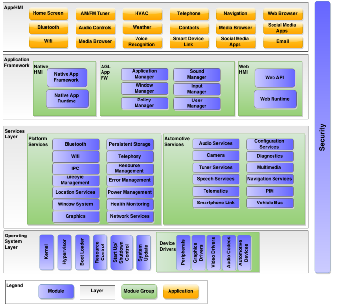

---

title : AGL Specification Overview
author: imported from Doors-ng by Fulup(iot.bzh)
date  : 2016-06-30
categories: architecture, automotive
tags: architecture, automotive, linux
layout: techdoc 
 
---

## Overview

Automotive  Grade  Linux  (AGL)  is  a  Linux  Foundation  Workgroup  dedicated  to  creating  open
source  software  solutions  for  automotive  applications.  Although  the  initial  target  for  AGL
is InVehicle Infotainment(IVI)  systems,  additional  use  cases  such  as  instrument  clusters  and  and
telematics  systems  will  eventually  be  supported.  AGL  has  participants  from  the  Automotive,
Communications,  and  Semiconductor  Industries  and  welcomes  contributions  from  individual
developers.

By  leveraging  the  over  \$10B  of  investment  made  in  the  Linux  kernel  and  other  open  source
software  projects,  the  AGL  Workgroup:

Enables  rapid  software  innovation  for  automotive  suppliers  to  keep  up  with  the  demand
from  consumers  for  better  IVI  experiences·

Utilizes  the  talents  of  thousands  of  open  source  software  developers  dedicated  to
maintaining  the  core  software  in  areas  like  the  Linux  kernel,  networking,  and
connectivity,  used  in  systems  across  numerous  industries
The  goals  of  the  Automotive  Grade  Linux  Workgroup  are  to  provide:

An  automotive-focused  core  Linux  operating  system  stack  that  meets  common  and
shared  requirements  of  the  automotive  ecosystem  with  a  broad  community  of
support  that  includes  individual  developers,  academic  organizations  and  companies.

A  transparent,  collaborative,  and  open  environment  for  Automotive  OEMs,  Tier  One
suppliers,  and  their  semiconductor  and  software  vendors  to  create  amazing  in-vehicle
software.

A  collective  voice  for  working  with  other  open  source  projects  and  developing  new  open
source  solutions.

An  embedded  Linux  distribution  that  enables  rapid  prototyping  for  developers  new  to
Linux  or  teams  with  prior  open  source  experience
This  results  in  faster  time  to  market  by  jump-starting  product  teams  with  reference  applications
running  on  multiple  hardware  platforms.
Page  5  of  159

  **Term**  |  **Definition**
  ----------| ------------------------------------------
  A2DP      |   Advanced  Audio  Distribution  Profile
  AGL       |   Automotive  Grade  Linux
  AVRCP     |   Audio  Video  Remote  Control  Profile
  FS        |   File  System
  GPS       |   Global  Positioning  System
  GPU       |   Graphical  Processing  Unit

Automotive Grade Linux Requirements Spec v1.0
{: class="image"}

## Document  Scope

[comment]: May  28,  2015
The  scope  of  this  document  is  to  define  the  architecture  of  the  Automotive  Grade  Linux  software
platform.  The  requirements  are  broken  up  into  an  overview  of  the  Architecture  and  a  description
of  each  of  the  layers  in  the  architecture  followed  by  the  requirements  for  each  module  in  the
various  layers.  The  Architecture  Diagram  and  the  layout  of  the  specification  take  into
consideration  all  of  the  components  that  would  be  needed  for  an  IVI  system;  however  the  are
missing  requirements  for  individual  modules.  As  the  spec  continues  to  evolve  those  sections  will
continue  to  be  filled  in.
The  main  goal  of  this  document  is  to  define  the  core  software  platform  from  which  applications
can  be  built.  As  such,  this  document  does  not  define  application  requirements  except  in  a  single
case  (Home  Screen).  Application  requirements  will  be  developed  by  various  projects  that  use  the
AGL  platform.  Those  application  requirements  can  be  used  to  drive  new  or  revised
requirements  into  the  platform.
At  this  time  there  is  no  plan  to  use  this  specification  to  create  a  compliance  or  certification
program.  The  specification  is  used  as  blueprint  to  guide  the  overall  work  of  AGL  and  to  derive
work  packages  for  companies  and  individuals  to  complete  in  order  to  attain  the  goals  of  the  AGL
Workgroup.

## Glossary  of  Terms

  HFP  |  Hands  Free  Profile
  --------| -------------------------------------
  IBOC  | In-Band  On  Channel
  LTSI  | Long  Term  Support  Initiative
  NTP   | Network  Time  Protocol
  OEM   | Original  Equipment  Manufacturer
  OS    | Operating  System
  OSS   | Open  Source  Software
  SDL   | Smart  Device  Link
  STT   | Speech  to  Text
  TTS   | Text  to  Speech
