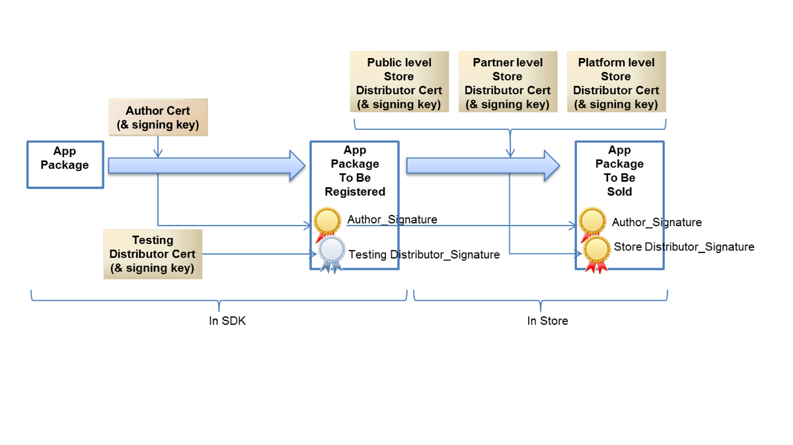

---

title : Threat Analysis & Coverage
date  : 2017-07-07
categories: architecture, automotive
tags: architecture, automotive, linux
layout: techdoc 
 
---

**Table of Content**

1. TOC
{:toc}

# Introduction

The Automotive Grade Linux (AGL) platform has set out to be an open source solution for automotive applications. With an open system come many avenues of attack by the spectrum of attackers, from hobbyists to university students to well-funded hacking organizations. AGL introduces an application framework and has adopted the Cynara system from Tizen, which uses SMACK as its kernel-level underpinnings.

This document first looks at attack goals and how the intruder may get to these goals. Then attacks on specific assets of the system are considered. Further, the analysis looks at the attack surface and possible branches into these assets. As these avenues are analyzed, we discuss mitigations individually and broader approaches, such as defense-in-depth which resists an attacker's ability to attain their goals by deploying *overlapping* defenses.

This threat analysis was written from an investigation of the following sources of information:

* AGL on-line documentation.
* The AGL source code-base, Charming Chinook Release, made available on Jan 6, 2017.
* Tizen documentation, on-which the security features of AGL have been based.

## Attack Goals

In today's connected vehicle, more and more functionality is moving to software control, meaning that the threat of attack becomes greater and greater. We see car features like navigation and summoning, car access/engine start, and motor/ECU upgrades all controlled through software and connections to the cloud. The risk of attack is high because there are high value targets in play.

Here, we outline some of the major threats categories along with some sample attackers, example attacks, and a relative importance. These threat categories are intended to be general examples. There can be many nuances to threat types. Additionally, there can be many *sub*-attacks that eventually lead to these higher level attack goals.

| Threat Category | Sample Attacker | Example Attacks | Relative Importance |
| --------------- | --------------- | -------- | ---------- |
| Vehicle theft | Individual, organized criminals | Send the car to an unplanned destination, get a key for the car, gain control of the unlock mechanism | Reduced likelihood of future vehicle purchases (Profit Later), bad press (Brand Integrity) |
| Reduced vehicle functionality | Terrorist groups, disgruntled employees | Lock the driver out of the car, cause the car to crash, block access to infotainment system | Inability sell paid-for apps and content (Profit Now), bad press (Brand Integrity), possible loss of life (Physical Injury) |
| Vehicle hacking | Vehicle owner, competitor | Get content without paying, modify DRM licenses, unlock of after-market features, theft of IP | Loss of sales for content and features (Profit Now), lawsuits from content owners (Profit Later), loss of competitive advantage (Profit Later) |
| Sensitive asset theft | Organized criminals, blackmailers | Steal credit card numbers, health information, camera data, steal bandwidth | Bad press (Brand Integrity), lawsuits from vehicle owners (Profit Later) |

## Assets and Security Categorization

This section outlines some of the assets that are likely to be found in the vehicle and their relative sensitivity from an attack point of view. Additionally, the final column on the right lists some of the recommended protection types that can be applied to these types of assets (Note that the empty cells refer to the cells above them). A good protection approach will give priority to the most sensitive assets, using a defense-in-depth approach to cover these assets. Less sensitive assets are treated at a lower priority, typically protected with fewer protection techniques. A more fine-grained prioritziation of the the assets in a concrete vehicle network can be achived with detailed threat analysis which considers the topology of the vehicle network and access-controls that are in-place. e.g. the EVITA framework for attack trees.

| Asset Category | Examples | Sensitivity | Recommended Protection Types |
| -------------- | -------- | ----------- | ---------------------------- |
| Software | ECU software, infotainment software, OS images | Critical | Key Management, Mutual Asymmetric Authentication, HSM and WhiteBox Encryption, Message Integrity Checks, Hardening/SW Protection, Program Transforms/ Obfuscation, Integrity Verification, Secure OS |
| Car Access | Biometric data, car keys | | |
| Payment Data | Credit cards, User profile critical data | | |
| Recordings | Internal camera recording, internal audio recording, external camera recording | High | Encryption, Message Integrity Checks, Hardening/SW Protection, Program Transforms / Obfuscation |
| User Profile | Usernames and passwords, customization, calendar, contacts | | |
| Location | GPS coordinates, vehicle usage data | | |
| Purchased Content | Video, audio, licenses | | |
| Teleconference | Chat, audio, video | Medium | SW Protection, Program Transforms / Obfuscation, Authenticated encryption for transmission
| Vehicle data | Vehicle info, sensor data | | |
| Navigation data | Static and dynamic maps | | |
| 3rd party data | Home automation commands, cloud game data | | |

# Execution Environment

The execution environment used for AGL leverages a Linux kernel combined with an application framework. The foundation of the environment is a pre-configured Linux kernel which will inherit any existing vulnerabilities associated with the kernel. The following are, therefore, important to the system:

## Kernel Version

The choice of kernel version for the AGL system is essential to its security. Depending on the type of board and eventual production system, different kernel versions are used. For example, one of the systems under study uses the Linux kernel version 3.10, while another uses the Linux kernel version 4.4. For the Linux kernel version 3.10.31, there are [25 known vulnerabilities](https://www.cvedetails.com/version/194332/Linux-Linux-Kernel-3.10.31.html). These vulnerabilities would allow an attacker to gain privileges, bypass access restrictions, allow memory to be corrupted, or cause denial of service. In contrast, the Linux kernel version of 4.4 has [many fewer known vulnerabilities](https://www.cvedetails.com/version/190796/Linux-Linux-Kernel-4.4.html). For this reason, we would in general recommend the later kernel version as a basis for the platform.

Note that, although there are fewer *known* vulnerabilities in the most recent kernel versions there may be many unknown vulnerabilities underlying. A rule of thumb is to update the kernel as much as possible to avoid the problems you do know, but you should not be complacent in the trust that you place in it. A defense-in-depth approach would then apply.

If there are constraints and dependencies in upgrading to a newer kernel version (e.g. device drivers, board support providers) and you are forced to an older Linux kernel version, there need to be additional provisions made to reduce the risk of kernel exploits, which can include memory monitoring, watch-dog services, and system call hooking. In this case, further defense-in-depth techniques may be required to mitigate the risk of attacks to known vulnerabilities, which can also include runtime integrity verfication of components that are vulnerable to tampering.

## Kernel Build Configuration

The kernel build configuration is extremely important for determining the level of access to services and to reduce the breadth of the attack surface. Linux contains a great and flexible number of capabilities and this is only controlled through the build configuration. For example, the *CONFIG_MODULES* parameter allows kernel modules to be loaded at runtime extending the capabilities of the kernel. This capability needs to be either inhibited or controlled at runtime through other configuration parameters. For example, *CONFIG_MODULE_SIG_FORCE=y* ensures that only signed modules are loaded. There is a very large number of kernel configuration parameters, and these are discussed in detail in [the hardening guide of the AGL security blueprint](http://docs.automotivelinux.org/docs/architecture/en/dev/reference/security/08-Hardening.html)

## Discretionary Access Control

Discretionary Access Control (DAC) is the traditional Linux method of separating users and groups from one another. In a shared environment where multiple users have access to a computer or network, Unix IDs have offered a way to contain access within privilege areas for individuals, or shared among the group or system. The Android system took this one step further, assigning new user IDs for each App. This was never the original intention of Linux UIDs, but was able to provide Android's initial security element - the ability to *sandbox* applications.

Although AGL mentions use of DAC for security isolation, the weight of the security responsibility lies in the Mandatory Access Control (MAC) and Cynara. Furthermore, there are system services with unique UIDs; however, the system does not go to the extreme of Android, where every application has its own UID. All sandboxing (app isolation) in AGL is handled in the MAC contexts.

## Mandatory Access Control

Mandatory Access Control (MAC) is an extension to DAC, whereby extended attributes (xattr) are associated with the filesystem. In the case of AGL, the `smackfs` filesystem allows files and directories to be associated with a SMACK label, providing the ability of further discrimination on access control. A SMACK label is a simple null terminated character string with a maximum of 255 bytes. While it doesn't offer the richness of an SELinux label, which provides a user, role, type, and level, the simplicity of a single value makes the overall design far less complex. There is arguably less chance of the security author making mistakes in the policies set forth.

## Application Types

AGL provides a framework for applications to be written in different forms:

* Web application: HTML5 + JavaScript
* Qt application: in a QML file
* Native application: in C

While there is no harm in providing multiple types of applications, from a security perspective this does increase the attack surface for an intruder. The application framework consists of a number of utilities and daemons which provide context for the applications. Isolation is provided through SMACK labels.

# Application Security Model

The AGL application framework consists of several interworking parts:

* SMACK - Simplified Mandatory Access Control Kernel, the kernel level LSM (Linux Security Module) that performs extended access control of the system
* Cynara - the native gatekeeper daemon used for policy handling, updating to the database and policy checking.
* Security Manager - a master service, through which all security events are intended to take place.
* Several native application framework utilities: afm-main-binding, afm-user-daemon, afm-system-daemon

## Application Framework

The [AGL app framework](http://iot.bzh/download/public/2016/appfw/02_Documentation-AppFW-Core-2.0.pdf), provides the management around installation, starting/stopping, bindings to D-Bus, and communications to Cynara and the Security Manager. Installation of applications flows through the `afm_system_daemon` and the `security_manager`. The Security Manager retains information in an SQLite database and also sets SMACK policies. The Security Manager also has the definition of an API for external entities.

The Security Manager communicates policy information to cynara, which retains information in its own database in the format of a text file with comma-separated values (CSV). There are provisions to retain a copy of the CSV text file when the file is being updated.

Runtime checking occurs through Cynara. Each application that is added to the framework has its own instantiation of a SMACK context and D-bus bindings. The `afb_daemon` and Binder form a web-service that is communicated to through http or a websocket from the application-proper. This http or websocket interface uses a standard unique web token for API communication.

### Attack Vectors

The following attack vectors are not completely independent. While attackers may have varying levels of access to an AGL system, experience has shown that a typical attack can start with direct access to a system, find the vulnerabilities, then proceed to automate the attack such that it can be invoked from less accessible standpoint (e.g. remotely). Therefore, it is important to assess all threat levels, and protect the system appropriately understanding that direct access attacks are the door-way into remote attacks.

#### Remote Attacks

The local web server interface used for applications is the first point of attack, as web service APIs are well understood and easily intercepted. The local web server could potentially be exploited by redirecting web requests through the local service and exploiting the APIs. While there is the use of a security token on the web service API, this is weak textual matching at best. This will not be difficult to spoof. It is well known that [API Keys do not provide any real security](http://nordicapis.com/why-api-keys-are-not-enough/).

It is likely that the architectural inclusion of an http / web-service interface provided the most flexibility for applications to be written natively or in HTML5; however, this flexibility may trade-off with security concerns. For example, if a native application were linked directly to the underlying framework services, there would be fewer concerns over remote attacks coming through the web-service interface.

Leaving the interface as designed, mitigations to attacks could include further securing the interface layer with cryptographic protocols: e.g. encrypted information passing, key exchange (e.g. Elliptic-Curve Diffie-Hellman).

#### User-level Native Attacks

* Modifying the CSV data-base
* Modifying the SQLite DB
* Tampering with the user-level binaries
* Tampering with the user daemons
* Spoofing the D-bus Interface
* Adding executables/libraries

With direct access to the device, there are many security concerns on the native level. For example, as Cynara uses a text file data-base with comma-separated values (CSV), an attacker could simply modify the data-base to escalate privileges of an application. Once a single application has all the privileges possible on the system, exploits can come through in this manner. Similarly the SQLite database used by the Security Manager is not much different than a simple text file. There are many tools available to add, remove, modify entries in an SQLite data-base.

On the next level, a common point of attack is to modify binaries or daemons for exploiting functionality. There are many Linux tools available to aid in this regard, including: [IDA Pro](https://www.hex-rays.com/products/ida/index.shtml), and [radare2](https://rada.re/r/). With the ability to modify binaries, an attacker can do any number of activities including: removing calls to security checks, redirecting control to bypass verification functionality, ignoring security policy handling, escalating privileges, etc.

Additionally, another attack vector would be to spoof the D-bus interface. D-bus is a message passing system built upon Inter-Process Communication (IPC), where structured messages are passed based upon a protocol. The interface is generic and well documented; and therefore, modifying or adding binaries/libraries to spoof this interface is a relatively straight-forward process. Once the interface has been spoofed, the attacker can issue any number of commands that lead into control of low-level functionality.

Protecting a system from native attacks requires a methodical approach. First, the system should reject processes that are not sanctioned to run. Signature-level verification at installation time will help in this regard, but run-time integrity verification is much better. Signatures need to originate from authorized parties, which is discussed further in a later section on the Application Store.

On the next level, executables should not be allowed to do things where they have not been granted permission. DAC and SMACK policies can help in this regard. On the other hand, there remain concerns with memory accesses, system calls, and other process activity that may go undetected. For this reason, a secure environment which monitors all activity can give indication of all unauthorized activity on the system.

Finally, it is very difficult to catch attacks of direct tampering in a system. These types of attacks require a defense-in-depth approach, where complementary software protection and hardening techniques are needed. Tamper-resistance and anti-reverse-engineering technologies include program transformations/obfuscation, integrity verification, and white-box cryptography. If applied in a mutually-dependent fashion and considering performance/security tradeoffs, the approach can provide an effective barrier to direct attacks to the system. Furthermore, the use of threat monitoring provides a valuable telemetry/analytics capability and the ability to react and renew a system under attack.

#### Root-level Native Attacks

* Tampering the system daemon
* Tampering Cynara
* Tampering the security manager
* Disabling SMACK
* Tampering the kernel

Once root-level access (i.e. su) has been achieved on the device, there are many ways to compromise the system. The system daemon, Cynara, and the security manager are vulnerable to tampering attacks. For example, an executable can be modified in memory to jam a branch, jump to an address, or disregard a check. This can be as simple as replacing a branch instruction with a NOP, changing a memory value, or using a debugger (e.g. gdb, IDA) to change an instruction. Tampering these executables would mean that policies can be ignored and verification checks can be bypassed.

Without going so far as to tamper an executable, the SMACK system is also vulnerable to attack. For example, if the kernel is stopped and restarted with the *security=none* flag, then SMACK is not enabled. Furthermore, systemd starts the loading of SMACK rules during start-up. If this start-up process is interfered with, then SMACK will not run. Alternatively, new policies can be added with smackload allowing unforseen privileges to alternative applications/executables.

Another intrusion on the kernel level is to rebuild the kernel (as it is open-source) and replace it with a copy that has SMACK disabled, or even just the SMACK filesystem (smackfs) disabled. Without the extended label attributes, the SMACK system is disabled.

Root-level access to the device has ultimate power, where the entire system can be compromised. More so, a system with this level access allows an attacker to craft a simpler *point-attack* which can operate on a level requiring fewer privileges (e.g. remote access, user-level access).

### Vulnerable Resources

#### Resource: `afm-user-daemon`

The `afm-user-daemon` is in charge of handling applications on behalf of a user. Its main tasks are:

* Enumerate applications that the end user can run and keep this list available on demand
* Start applications on behalf of the end user, set user running environment, set user security context
* List current runnable or running applications
* Stop (aka pause), continue (aka resume), terminate a running instance of a given application
* Transfer requests for installation/uninstallation of applications to the corresponding system daemon afm-system-daemon

The afm-user-daemon launches applications. It builds a secure environment for the application before starting it within that environment. Different kinds of applications can be launched, based on a configuration file that describes how to launch an application of a given kind within a given launching mode: local or remote. Launching an application locally means that the application and its binder are launched together. Launching an application remotely translates in only launching the application binder.

The UI by itself has to be activated remotely by a request (i.e. HTML5 homescreen in a browser). Once launched, running instances of the application receive a runid that identifies them. afm-user-daemon manages the list of applications that it has launched. When owning the right permissions, a client can get the list of running instances and details about a specific running instance. It can also terminate, stop or continue a given application. If the client owns the right permissions, afm-user-daemon delegates the task of installing and uninstalling applications to afm-system-daemon.

afm-user-daemon is launched as a systemd service attached to a user session. Normally, the service file is located at /usr/lib/systemd/user/afm-user-daemon.service.

Attacker goals:

* Disable `afm-user-daemon`
* Tamper with the afm-user-daemon configuration
	* /usr/lib/systemd/user/afm-user-daemon.service
	* Application(widget) config.xml file
	* /etc/afm/afm-launch.conf (launcher configuration)

* Escalate user privileges to gain more access with  afm-user-daemon
* Install malicious application (widget)
* Tamper with afm-user-daemon on disk or in memory

#### Resource: `afm-system-daemon`

The `afm-system-daemon` is in charge of installing applications on the AGL system. Its main tasks are:

* Install applications and setup security framework for newly installed applications
* Uninstall applications

`afm-system-daemon` is launched as a systemd service attached to system. Normally, the service file is located at /lib/systemd/system/afm-systemdaemon.service.

Attacker goals:

* Disable afm-system-daemon
* Tamper with the afm-system-daemon configuration
* Tamper afm-system-daemon on disk or in memory

#### Resource `afb-daemon`

`afb-binder` is in charge of serving resources and features through an HTTP interface. `afb-daemon` is in charge of binding one instance of an application to the AGL framework and AGL system. The application and its companion binder run in a secured and isolated environment set for them. Applications are intended to access to AGL system through the binder. afb-daemon binders serve files through HTTP protocol and offers developers the capability to expose application API methods through HTTP or WebSocket protocol.

Binder bindings are used to add APIs to afb-daemon. The user can write a binding for afb-daemon. The binder afb-daemon serves multiple purposes:

1. It acts as a gateway for the application to access the system;
2. It acts as an HTTP server for serving files to HTML5 applications;
3. It allows HTML5 applications to have native extensions subject to security enforcement for accessing hardware resources or for speeding up parts of algorithm.

Attacker goals:

* Break from isolation
* Disable afb-daemon
* Tamper afb-demon on disk or in memory
* Tamper capabilities by creating/installing  custom bindings for afb-daemon

## Cynara

[Cynara](https://wiki.tizen.org/Security:Cynara) was adopted from the Tizen security framework and consists of several parts:

* Cynara - a daemon for controlling policies and responding to access control requests
* Database - a spot to hold policies
* Libraries - several static and dynamic libraries for communicating with Cynara

The daemon communicates to the libraries over Unix domain sockets. The database storage format is a [series of CSV-like files with an index file](https://wiki.tizen.org/Security:Cynara:Storage).

There are several ways that an attacker can manipulate policies of the Cynara system:

* Disable Cynara by killing the process
* Tamper with the Cynara binary on-disk or in-memory
* Corrupt the database controlled by Cynara
* Tamper with the database controlled by Cynara
* Highjack the communication between Cynara and the database

The text-based database is the weakest part of the system and although there are some consistency mechanisms in place (i.e. the backup guard), these mechanisms are weak at best and can be countered by an attacker very easily.

## SMACK

Linux Security Modules (LSM) is a framework in the linux kernel which provides the ability to implement Mandatory Access Control (MAC) with different models. The SMACK model is a simplified mandatory access control, starting with character-based labels on files and directories. There are 4 major components to the system:

1. The LSM kernel module.
2. The `smackfs` filesystem.
3. Basic utilites for policy management and checking
4. The policy/configuration data

As with any mandatory access system, the policy management needs to be carefully separated from the checking, as the management utilities can become a convenient point of attack. Dynamic additions to the policy system need to be carefully verified, as the ability to update the policies is often needed, but introduces a possible threat. Finally, even if the policy management is well secured, the policy checking and failure response to that checking is also of vital importance to the smooth operation of the system.

While MAC is a certainly a step up in security when compared to DAC, there are still many ways to compromise a SMACK-enabled Linux system. Some of these ways are as follows:

* Disabling SMACK at invocation of the kernel (with command-line: security=none).
* Disabling SMACK in the kernel build and redeploying the kernel.
* Changing a SMACK attribute of a file or directory at install time.
* Tamperig with a process with the `CAP_MAC_ADMIN` privilege.
* Setting/Re-setting the SMACK label of a file.
* Tampering with the default domains (i.e. /etc/smack/accesses.d/default-access-domains).
* Disabling or tampering with the SMACK filesystem (i.e. /smackfs).
* Adding policies with smackload (adding the utility if not present).
* Changing labels with chsmack (adding the utility if not present).

# Application Store

Although the Tizen system has defined a [system of App signing and signing flow](https://wiki.tizen.org/Security/Tizen_3.X_Overview#Application_Singing_and_Certificates) to avoid the spread of unauthorized Apps that might contain malware. At this point, it is unclear how much of this flow AGL will adopt; however, judging from the experience, it is an essential topic. For example, the Google Play Store controls the authorization of Apps through signing, and still, there are [many accounts of Apps containing malware on the store](http://www.eweek.com/mobile/researchers-find-132-malware-infected-android-apps-on-google-play).

Tizen defines 5 levels of certificates and signing at each level, including an author, testing distributor, public level store distributor, partner level store distributor, and platform level store distributor. AGL may define a different number of third parties, but at a minimum an author and store distributor should be defined.

Once the number of signatures has been established, verification of those signatures needs to be done at a minimum at installation time on the AGL device. It is important to ensure the robustness/integrity of the public key used for signature verification. If the public key is modified, then this compromised key can be used to verify an attacker's private key signature.

Further to this, installation-time verification is limited. Attacks can happen to apps in-memory at runtime. Any modifications made after installation will be missed by installation-time verification. Integrity verification that runs during execution makes for a more complete security story.

# External Threats

## Attacks from the Cloud

### OTA Updates

Updates of software over-the-air are one of the most common points where an attacker will penetrate. An OTA update mechanism is one of the highest threats in the system. If an attacker is able to install his own application or firmware on the system, he can get the same level of access that the original application or firmware had. From that point, the intruder can get unfettered access to the rest of the system, which might include making modifications, downloading other pieces of software, and stealing assets.

#### Man-in-the-middle (MITM)

The man-in-the-middle attack is the most classic example of an attack, where an adversary inserts himself between two communicating entities and grabs whatever is being communicated. In the case of OTA attacks, the connection in the network may be intercepted:

* On the internet, before the cloud backend.
* At the base station, 3G,4G,5G connection to the internet.
* At the receiving antenna, connection to the car.
* Between the receiving antenna and the gateway router (if present), connection within the car.
* Between the gateway router and the target component (IVI, In-Vehicle Infotainment unit).

There are many ways to mount a MITM attack. For example, proxy tools like Burp Proxy can be used to intercept web traffic as a man-in-the-middle. Under the guise of being a testing tool, the proxy server is often used in attack scenarios. It runs on a variety of platforms.

As another example, false base station attacks are known to be fairly easy to set-up. The problem is apparently fairly prevalent in countries like China and in the UK. These fake base stations are sometimes just eavesdropping on the communication, but others have the potential to do serious harm.

Defenses against MITM attacks include encrypted and signed data pipes. Furthermore, architects and developers are also recommended to encrypt and sign the payloads that are being passed over these pipes, to defend against perusal of the data.

### Man-at-the-end (MATE) Attacks

The man-at-the-end attack is when an intruder analyzes the end-point of the communication when software is accessing the data communication. This is a more severe attack type where the attacker can:

* Steal keys.

	For example, a simple debugging session in running software could reveal a key used in memory.

* Tamper software.

	For example, replacing just one function call in software with a NOP (i.e. no operation) can drastically change the behavior of the program.

* Jam branches of control.

	For example, making a program take one branch of control rather than the intended branch can mean the difference between an authorized and a non-authorized installation.

* Modify important data.

	For example, if the data changed is a key or data leading to a control path, then this attack can be severe.

	In the case of OTA updates, MATE attacks are particularly problematic for the system. One of the consequences of MATE attacks can be installed software that allows installation of any other software. For example, an attacker might install remote access software to control any part of the system.

## Malicious Physical Attacks

### CAN & USB devices

On just about every vehicle, ECUs (Electronic Control Units) communicate over a CAN (Controller Area Network) bus, which is a two-wire bus using hardware arbitration for messages sent on the shared medium. This is essentially a *trusted* network where all traffic is visible to all controllers and any controller can send any message.

A malicious ECU on the CAN bus can easily inject messages destined for any other device, including things like the instrument cluster and the head unit. There are common ways for hardware to do USB to CAN and open source software to send and receive messages. For example, there is a driver included in the Linux kernel that can be used to send/receive CAN signals. A malicious device on the CAN bus can cause a great number of harmful things to happen to the system, including: sending bogus information to other devices, sending unintended commands to ECUs, causing DOS (Denial Of Service) on the CAN bus, etc.

# Conclusion

The Automotive Grade Linux (AGL) initiative builds upon open-source software including Linux and Tizen to offer a flexible application framework. However, the security provisions of the app framework, Cynara, and the security manager only go so far in keeping the biggest threats at bay. As experience has shown, providing a constrained app (like that in the Android Open Source Platform) and store development flow, signature verification, DAC sandboxing, and MAC (SMACK) controls over the platform can have a certain amount of success with the security of the system. However, the openness of the system invites many researchers, hobbyists and hackers and financially motivated attackers to compromise the system for their own gains.

As AGL arrives on modern automobiles, this is inevitably inviting many capable actors to modify, attack, and compromise these well thought-out systems and their applications. With concerns like safety and security, the auto industry cannot afford to go the way of consumer devices like phones and tablets where security problems are encountered on a frequent basis. It is imperative to use a layered approach and defense-in-depth to protect the system from inevitable attack.

This document has described both general attack goals and specific threats to the AGL system. While those may think that a remote attack is the biggest concern, the reader should be aware that an open-source software system invites people to first research direct attacks before crafting remote attacks. Don't underestimate the creative ability for hackers to find the weakest link in a product. This has been shown time and time again in open products.

