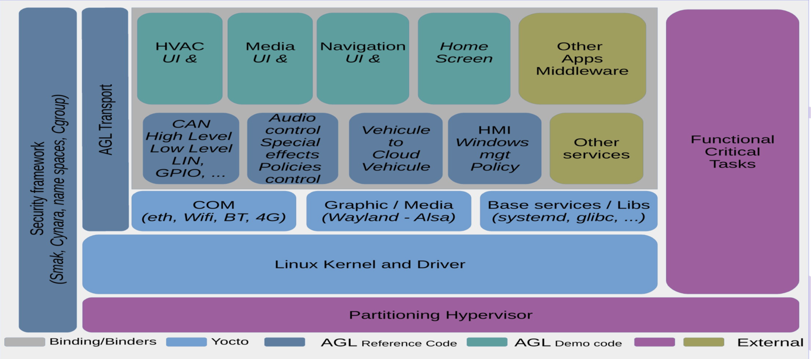

# Introduction

This document presents the different attacks that can be envisaged on a recent car in order to be able to create a set of tests verifying the security of Automotive Grade Linux (AGL).
The more general utility behind this document is to protect the manufacturers, customers and third party from potential financial and information loss.
This document is firstly based on the existing security-blueprint.

**For security to be effective, the concepts must be simple. And by default, anything that is not allowed is forbidden.**

We will cover topics starting from the lowest level (_Hardware_) up to the highest levels (_Connectivity_ and _Application_). We will move quickly on _Hardware_ and _Connectivity_ because this is not supported at our level. Solutions of connectivity problems concern updates and secured settings while hardware securing is related to the manufacturers.

The document is filled with tags to easily identify important points:

<!-- section-config -->

- The _config_ tag quickly identifies the configurations and the recommendations to take.

<!-- end-section-config --><!-- section-note -->

- The _note_ tag allows you to notify some additional details.

<!-- end-section-note --><!-- section-todo -->

- The _todo_ tag shows the possible improvements.

<!-- end-section-todo -->

In annexes of this document, you can find all the _config_ and _todo_ notes.

## Hardening term

The term Hardening refers to the tools, techniques and processes required in order to reduce the attack surface on an embedded system, such as an embedded control unit (**ECU**) or other managed devices. The target for all hardening activities is to prevent the execution of invalid binaries on the device, and to prevent copying of security related data from the device.

<!-- pagebreak -->

## AGL security overview

AGL roots are based on security concepts. Those concepts are implemented by the security framework as shown in this picture:

--------------------------------------------------------------------------------

# Acronyms and Abbreviations

The following table lists the strongest terms utilized within all this document.

Acronyms or Abbreviations | Description
------------------------- | -----------------------------------
_AGL_                     | **A**utomotive **G**rade **L**inux
_ECU_                     | **E**lectronic **C**ontrol **U**nit

--------------------------------------------------------------------------------

<!-- pagebreak -->

# References

- [security-blueprint](http://docs.automotivelinux.org/docs/architecture/en/dev/reference/security/01-overview.html).
  - _http:// docs.automotivelinux.org/docs/architecture/en/dev/reference/security/01-overview.html_
- **[2017]** - [kernel security](https://www.kernel.org/doc/Documentation/security/).
  - _https:// www.kernel.org/doc/Documentation/security/_
- **[2017]** - [Systemd integration and user management](http://iot.bzh/download/public/2017/AMM-Dresden/AGL-systemd.pdf).
  - _http:// iot.bzh/download/public/2017/AMM-Dresden/AGL-systemd.pdf_
- **[2017]** - [AGL - Application Framework Documentation](http://iot.bzh/download/public/2017/SDK/AppFw-Documentation-v3.1.pdf).
  - _http:// iot.bzh/download/public/2017/SDK/AppFw-Documentation-v3.1.pdf_
- **[2017]** - [Improving Vehicle Cybersecurity](https://access.atis.org/apps/group_public/download.php/35648/ATIS-I-0000059.pdf).
  - _https:// access.atis.org/apps/group_public/download.php/35648/ATIS-I-0000059.pdf_
- **[2016]** - [AGL framework overview](http://docs.automotivelinux.org/docs/apis_services/en/dev/reference/af-main/0-introduction.html).
  - _http:// docs.automotivelinux.org/docs/apis_services/en/dev/reference/af-main/0-introduction.html_
- **[2016]** - [SecureBoot-SecureSoftwareUpdates](http://iot.bzh/download/public/2016/publications/SecureBoot-SecureSoftwareUpdates.pdf).
  - _http:// iot.bzh/download/public/2016/publications/SecureBoot-SecureSoftwareUpdates.pdf_
- **[2016]** - [Linux Automotive Security](http://iot.bzh/download/public/2016/security/Linux-Automotive-Security-v10.pdf).
  - _http:// iot.bzh/download/public/2016/security/Linux-Automotive-Security-v10.pdf_
- **[2016]** - [Automotive Security Best Practices](https://www.mcafee.com/it/resources/white-papers/wp-automotive-security.pdf).
  - _https:// www.mcafee.com/it/resources/white-papers/wp-automotive-security.pdf_
- **[2016]** - [Gattacking Bluetooth Smart Devices](http://gattack.io/whitepaper.pdf).
  - _http:// gattack.io/whitepaper.pdf_
- **[2015]** - [Comprehensive Experimental Analysis of Automotive Attack Surfaces](http://www.cs.wayne.edu/fengwei/15fa-csc6991/slides/8-CarHackingUsenixSecurity.pdf).
  - _http:// www.cs.wayne.edu/fengwei/15fa-csc6991/slides/8-CarHackingUsenixSecurity.pdf_
- **[2015]** - [Security in Automotive Bus Systems](http://citeseerx.ist.psu.edu/viewdoc/download?doi=10.1.1.92.728&rep=rep1&type=pdf).
  - _http:// citeseerx.ist.psu.edu/viewdoc/download?doi=10.1.1.92.728&rep=rep1&type=pdf_
- **[2014]** - [IOActive Remote Attack Surface](https://www.ioactive.com/pdfs/IOActive_Remote_Attack_Surfaces.pdf).
  - _https:// www.ioactive.com/pdfs/IOActive_Remote_Attack_Surfaces.pdf_
- **[2011]** - [A practical attack against GPRS/EDGE/UMTS/HSPA mobile data communications](https://media.blackhat.com/bh-dc-11/Perez-Pico/BlackHat_DC_2011_Perez-Pico_Mobile_Attacks-wp.pdf).
  - _https:// media.blackhat.com/bh-dc-11/Perez-Pico/BlackHat_DC_2011_Perez-Pico_Mobile_Attacks-wp.pdf_
- **[2011]** - [Comprehensive Experimental Analyses of Automotive Attack Surfaces](http://www.autosec.org/pubs/cars-usenixsec2011.pdf).
  - _http:// www.autosec.org/pubs/cars-usenixsec2011.pdf_
- **[2010]** - [Relay Attacks on Passive Keyless Entry and Start Systems in Modern Cars](https://eprint.iacr.org/2010/332.pdf).
  - _https:// eprint.iacr.org/2010/332.pdf_
- **[2010]** - [Wifi attacks wep wpa](https://matthieu.io/dl/wifi-attacks-wep-wpa.pdf).
  - _https:// matthieu.io/dl/wifi-attacks-wep-wpa.pdf_
- **[2008]** - [SMACK](http://schaufler-ca.com/yahoo_site_admin/assets/docs/SmackWhitePaper.257153003.pdf).
  - _http:// schaufler-ca.com/yahoo_site_admin/assets/docs/SmackWhitePaper.257153003.pdf_
