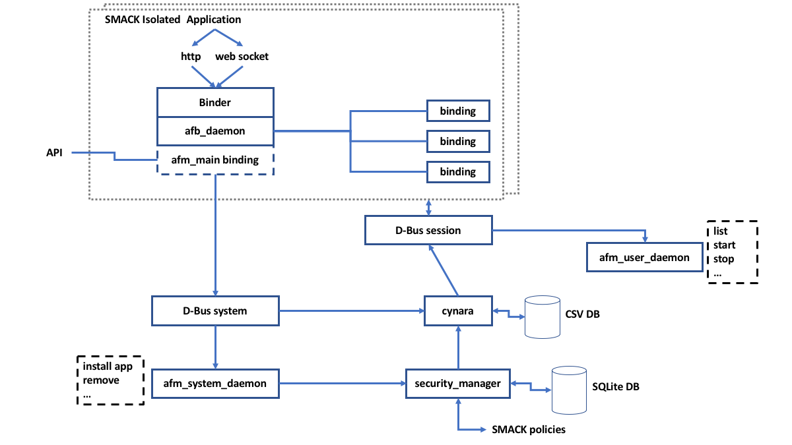

# Application framework/model (**AppFw**)

The AGL application framework consists of several inter-working parts:

- **SMACK**: The kernel level **LSM** (**L**inux **S**ecurity **M**odule) that performs extended access control of the system.
- **Cynara**: the native gatekeeper daemon used for policy handling, updating to the database and policy checking.
- Security Manager: a master service, through which all security events are intended to take place.
- Several native application framework utilities: `afm-main-binding`, `afm-user-daemon`, `afm-system-daemon`.

The application framework manages:

- The applications and services management: Installing, Uninstalling, Listing, ...
- The life cycle of applications: Start -> (Pause, Resume) -> Stop.
- Events and signals propagation.
- Privileges granting and checking.
- API for interaction with applications.

<!-- section-note -->

- The **security model** refers to the security model used to ensure security
  and to the tools that are provided for implementing that model. It's an
  implementation detail that should not impact the layers above the application
  framework.

- The **security model** refers to how **DAC** (**D**iscretionary **A**ccess **C**ontrol),
  **MAC** (Mandatory Access Control) and `Capabilities` are used by the system to
  ensure security and privacy. It also includes features of reporting using
  audit features and by managing logs and alerts.

<!-- end-section-note -->

The **AppFw** uses the security model to ensure the security and the privacy of
the applications that it manages. It must be compliant with the underlying
security model. But it should hide it to the applications.

<!-- section-config -->

Domain                 | Object         | Recommendations
---------------------- | -------------- | --------------------------------
Platform-AGLFw-AppFw-1 | Security model | Use the AppFw as Security model.

<!-- end-section-config -->

See [AGL AppFw Privileges Management](http://docs.automotivelinux.org/docs/devguides/en/dev/reference/iotbzh2016/appfw/03-AGL-AppFW-Privileges-Management.pdf) and [AGL - Application Framework Documentation](http://iot.bzh/download/public/2017/SDK/AppFw-Documentation-v3.1.pdf) for more
information.

<!-- pagebreak -->

The Security Manager communicates policy information to **Cynara**,
which retains information in its own database in the format of a text
file with comma-separated values (CSV). There are provisions to retain
a copy of the CSV text file when the file is being updated.

Runtime checking occurs through **Cynara**. Each application that is
added to the framework has its own instantiation of a SMACK context
and D-bus bindings. The afb_daemon and Binder form a web-service that
is communicated to through http or a websocket from the application-proper.
This http or websocket interface uses a standard unique web token for API communication.

## Cynara

There's a need for another mechanism responsible for checking applicative
permissions: Currently in AGL, this task depends on a policy-checker service
(**Cynara**).

- Stores complex policies in databases.
- "Soft" security (access is checked by the framework).

Cynara interact with **D-Bus** in order to deliver this information.

Cynara consists of several parts:

- Cynara: a daemon for controlling policies and responding to access control requests.
- Database: a spot to hold policies.
- Libraries: several static and dynamic libraries for communicating with Cynara.

The daemon communicates to the libraries over Unix domain sockets.
The database storage format is a series of CSV-like files with an index file.

There are several ways that an attacker can manipulate policies of the Cynara system:

- Disable Cynara by killing the process.
- Tamper with the Cynara binary on-disk or in-memory.
- Corrupt the database controlled by Cynara.
- Tamper with the database controlled by Cynara.
- Highjack the communication between Cynara and the database.

The text-based database is the weakest part of the system and although there are some
consistency mechanisms in place (i.e. the backup guard), these mechanisms are weak at best
and can be countered by an attacker very easily.

<!-- section-config -->

Domain                  | Object      | Recommendations
----------------------- | ----------- | -------------------------------------
Platform-AGLFw-Cynara-1 | Permissions | Use Cynara as policy-checker service.

<!-- end-section-config -->

### Policies

- Policy rules:

  - Are simple - for pair [application context, privilege] there is straight
    answer (single Policy Type): [ALLOW / DENY / ...].
  - No code is executed (no script).
  - Can be easily cached and managed.

- Application context (describes id of the user and the application credentials)
  It is build of:

  - UID of the user that runs the application.
  - **SMACK** label of application.

## Holding policies

Policies are kept in buckets. Buckets are set of policies which have additional
a property of default answer, the default answer is yielded if no policy matches
searched key. Buckets have names which might be used in policies (for directions).

## Attack Vectors

The following attack vectors are not completely independent. While attackers may
have varying levels of access to an AGL system, experience has shown that a typical
attack can start with direct access to a system, find the vulnerabilities,
then proceed to automate the attack such that it can be invoked from less accessible
standpoint (e.g. remotely). Therefore, it is important to assess all threat levels,
and protect the system appropriately understanding that direct access attacks
are the door-way into remote attacks.

### Remote Attacks

The local web server interface used for applications is the first point of attack,
as web service APIs are well understood and easily intercepted. The local web server
could potentially be exploited by redirecting web requests through the local service
and exploiting the APIs. While there is the use of a security token on the web
service API, this is weak textual matching at best. This will not be difficult to spoof.
It is well known that [API Keys do not provide any real security](http://nordicapis.com/why-api-keys-are-not-enough/).

It is likely that the architectural inclusion of an http / web-service interface
provided the most flexibility for applications to be written natively or in HTML5.
However, this flexibility may trade-off with security concerns. For example,
if a native application were linked directly to the underlying framework services,
there would be fewer concerns over remote attacks coming through the web-service interface.

Leaving the interface as designed, mitigations to attacks could include further
securing the interface layer with cryptographic protocols:
e.g. encrypted information passing, key exchange (e.g. Elliptic-Curve Diffie-Hellman).

### User-level Native Attacks

- Modifying the CSV data-base
- Modifying the SQLite DB
- Tampering with the user-level binaries
- Tampering with the user daemons
- Spoofing the D-bus Interface
- Adding executables/libraries

With direct access to the device, there are many security concerns on the native level.
For example, as **Cynara** uses a text file data-base with comma-separated values (CSV),
an attacker could simply modify the data-base to escalate privileges of an application.
Once a single application has all the privileges possible on the system, exploits can
come through in this manner. Similarly the SQLite database used by the Security Manager
is not much different than a simple text file. There are many tools available to add,
remove, modify entries in an SQLite data-base.

On the next level, a common point of attack is to modify binaries or daemons for exploiting
functionality. There are many Linux tools available to aid in this regard,
including: [IDA Pro](https://www.hex-rays.com/products/ida/index.shtml),
and [radare2](https://rada.re/r/). With the ability to modify binaries,
an attacker can do any number of activities including: removing calls to security checks,
redirecting control to bypass verification functionality, ignoring security policy handling,
escalating privileges, etc.

Additionally, another attack vector would be to spoof the D-bus interface. D-bus is a
message passing system built upon Inter-Process Communication (IPC), where structured
messages are passed based upon a protocol. The interface is generic and well documented.
Therefore, modifying or adding binaries/libraries to spoof this interface is a relatively
straight-forward process. Once the interface has been spoofed, the attacker can issue any
number of commands that lead into control of low-level functionality.

Protecting a system from native attacks requires a methodical approach. First, the system
should reject processes that are not sanctioned to run. Signature-level verification at
installation time will help in this regard, but run-time integrity verification is much better.
Signatures need to originate from authorized parties, which is discussed further
in a later section on the Application Store.

On the next level, executables should not be allowed to do things where they have not been
granted permission. DAC and SMACK policies can help in this regard. On the other hand,
there remain concerns with memory accesses, system calls, and other process activity
that may go undetected. For this reason, a secure environment which monitors all activity
can give indication of all unauthorized activity on the system.

Finally, it is very difficult to catch attacks of direct tampering in a system.
These types of attacks require a defense-in-depth approach, where complementary software
protection and hardening techniques are needed. Tamper-resistance and anti-reverse-engineering
technologies include program transformations/obfuscation, integrity verification,
and white-box cryptography. If applied in a mutually-dependent fashion and considering
performance/security tradeoffs, the approach can provide an effective barrier
to direct attacks to the system. Furthermore, the use of threat monitoring provides a
valuable telemetry/analytics capability and the ability to react and renew a system under attack.

### Root-level Native Attacks

- Tampering the system daemon
- Tampering Cynara
- Tampering the security manager
- Disabling SMACK
- Tampering the kernel

Once root-level access (i.e. su) has been achieved on the device, there are many ways
to compromise the system. The system daemon, **Cynara**, and the security manager are
vulnerable to tampering attacks. For example, an executable can be modified in memory
to jam a branch, jump to an address, or disregard a check. This can be as simple as replacing
a branch instruction with a NOP, changing a memory value, or using a debugger (e.g. gdb, IDA)
to change an instruction. Tampering these executables would mean that policies can be
ignored and verification checks can be bypassed.

Without going so far as to tamper an executable, the **SMACK** system is also vulnerable to attack.
For example, if the kernel is stopped and restarted with the *security=none* flag,
then SMACK is not enabled. Furthermore, `systemd` starts the loading of **SMACK** rules during
start-up. If this start-up process is interfered with, then **SMACK** will not run.
Alternatively, new policies can be added with `smackload` allowing unforseen privileges
to alternative applications/executables.

Another intrusion on the kernel level is to rebuild the kernel (as it is open-source)
and replace it with a copy that has **SMACK** disabled, or even just the **SMACK** filesystem
(`smackfs`) disabled. Without the extended label attributes, the **SMACK** system is disabled.

Root-level access to the device has ultimate power, where the entire system can be compromised.
More so, a system with this level access allows an attacker to craft a simpler *point-attack*
which can operate on a level requiring fewer privileges (e.g. remote access, user-level access).

## Vulnerable Resources

### Resource: `afm-user-daemon`

The `afm-user-daemon` is in charge of handling applications on behalf of a user. Its main tasks are:

- Enumerate applications that the end user can run and keep this list available on demand.
- Start applications on behalf of the end user, set user running environment, set user security context.
- List current runnable or running applications.
- Stop (aka pause), continue (aka resume), terminate a running instance of a given application.
- Transfer requests for installation/uninstallation of applications to the corresponding system daemon afm-system-daemon.

The `afm-user-daemon` launches applications. It builds a secure environment for the application
before starting it within that environment. Different kinds of applications can be launched,
based on a configuration file that describes how to launch an application of a given kind within
a given launching mode: local or remote. Launching an application locally means that
the application and its binder are launched together. Launching an application remotely
translates in only launching the application binder.

The UI by itself has to be activated remotely by a request (i.e. HTML5 homescreen in a browser).
Once launched, running instances of the application receive a `runid` that identifies them.
`afm-user-daemon` manages the list of applications that it has launched.
When owning the right permissions, a client can get the list of running instances and details
about a specific running instance. It can also terminate, stop or continue a given application.
If the client owns the right permissions, `afm-user-daemon` delegates the task of
installing and uninstalling applications to `afm-system-daemon`.

`afm-user-daemon` is launched as a `systemd` service attached to a user session.
Normally, the service file is located at /usr/lib/systemd/user/afm-user-daemon.service.

Attacker goals:

- Disable `afm-user-daemon`.
- Tamper with the `afm-user-daemon` configuration.
  - /usr/lib/systemd/user/afm-user-daemon.service.
  - Application(widget) config.xml file.
  - /etc/afm/afm-launch.conf (launcher configuration).

- Escalate user privileges to gain more access with `afm-user-daemon`.
- Install malicious application (widget).
- Tamper with `afm-user-daemon` on disk or in memory.

### Resource: `afm-system-daemon`

The `afm-system-daemon` is in charge of installing applications on the AGL system. Its main tasks are:

- Install applications and setup security framework for newly installed applications.
- Uninstall applications.

`afm-system-daemon` is launched as a `systemd` service attached to system. Normally,
the service file is located at /lib/systemd/system/afm-systemdaemon.service.

Attacker goals:

- Disable `afm-system-daemon`.
- Tamper with the `afm-system-daemon` configuration.
- Tamper `afm-system-daemon` on disk or in memory.

### Resource `afb-daemon`

`afb-binder` is in charge of serving resources and features through an HTTP interface.
`afb-daemon` is in charge of binding one instance of an application to the AGL framework
and AGL system. The application and its companion binder run in a secured and isolated
environment set for them. Applications are intended to access to AGL system through the binder.
`afb-daemon` binders serve files through HTTP protocol and offers developers the capability
to expose application API methods through HTTP or WebSocket protocol.

Binder bindings are used to add APIs to `afb-daemon`. The user can write a binding for `afb-daemon`.
The binder `afb-daemon` serves multiple purposes:

1. It acts as a gateway for the application to access the system.
2. It acts as an HTTP server for serving files to HTML5 applications.
3. It allows HTML5 applications to have native extensions subject to security enforcement for accessing hardware resources or for speeding up parts of algorithm.

Attacker goals:

- Break from isolation.
- Disable `afb-daemon`.
- Tamper `afb-demon` on disk or in memory.
- Tamper **capabilities** by creating/installing custom bindings for `afb-daemon`.