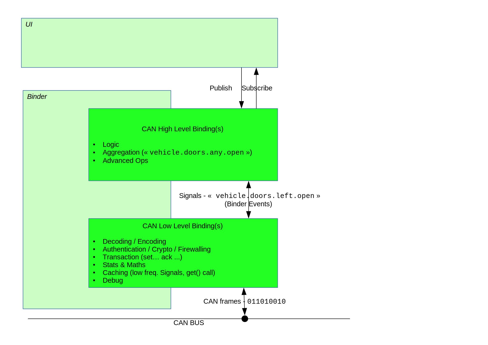
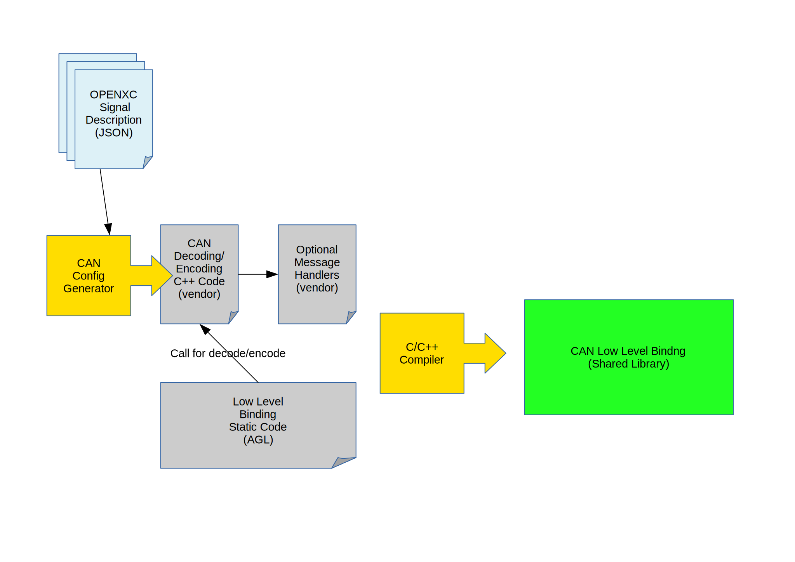
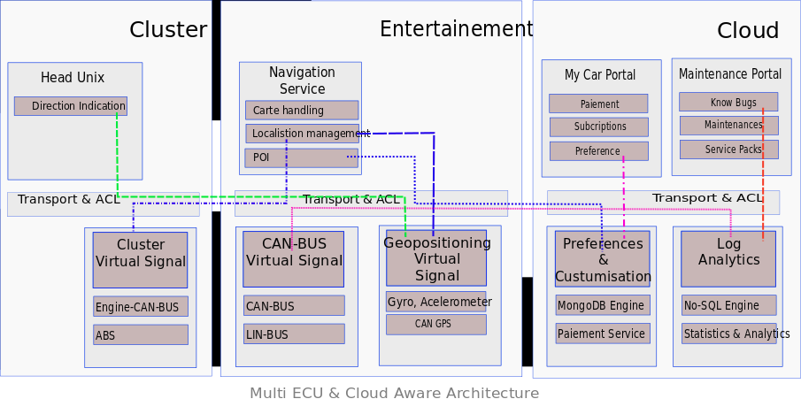

**Table of Content**

1. TOC

{:toc}

## Context

Automotive applications need to understand in real time the context in which
vehicles operate. In order to do so, it is critical for automotive application
to rely on a simple, fast and secure method to access data generated by the
multiple sensors/ECU embedded in modern cars.

This signaling problem is neither new, neither unique to the automotive and
multiple solutions often described as Message Broker or Signaling Gateway have
been around for a while.

The present document is the now implemented since AGL Daring Dab version, to
handle existing signaling/message in a car. It relies on [[APbinder]]
binder/bindings model to minimize complexity while keeping the system fast
around secure. We propose a model with multiple transport options and a full set
of security feature to protect the service generating the signal as well as
consuming them.

## Objectives

Our objectives are solving following 3 key issues:

1. reduce as much as possible the amount of exchanged data to the meaningful
 subset really used by applications
1. offer a high level API that obfuscates low level and proprietary interface to
 improve stability in time of the code
1. hide specificities of low level implementation as well as the chosen
 deployment distribution model.

To reach first objective, events emission frequency should be controlled at the
lowest level it possibly can. Aggregation, composition, treatment, filtering of
signals should be supported at software level when not supported by the hardware.

Second objectives of offering long term stable hight level API while allowing
flexibility in changing low level implementation may look somehow conflicting.
Nevertheless by isolating low level interface from high level and allowing
dynamic composition it is possible to mitigate both objectives.

## Architecture

Good practice is often based on modularity with clearly separated components
assembled within a common framework. Such modularity ensures separation of
duties, robustness, resilience and achievable long term maintenance.

This document uses the term "**Service**" to define a specific instance of this
proposed common framework used to host a group of dedicated separated components
that handle targeted signals/events. Each service exposes to services/applications
the signals/events it is responsible for.

As an example, a CAN service may want to mix non-public proprietary API with
CANopen compatible devices while hiding this complexity to applications. The
goal is on one hand to isolate proprietary piece of code in such a way that it
is as transparent as possible for the remaining part of the architecture. On a
second hand isolation of code related to a specific device provides a better
separation of responsibilities, keeping all specificity related to a given
component clearly isolated and much easier to test or maintain. Last but not
least if needed this model may also help to provide some proprietary code
directly as binary and not as source code.

Communicating between the car and regular apps should be done using a 2 levels
AGL services which have two distincts roles:

- low level should handle communication with CAN bus device (read, decoding,
 basic and efficient filtering, caching, ...)
- high level should handle more complex tasks (signals compositions, complex
 algorythms like Kalman filter, business logic...)



To do so, the choice has been to use a similar architecture than [[OpenXC]], a
Ford project. Principle is simple, from a JSON file that describes all CAN
signals wanted to be handled, in general a conversion from a **dbc** file, AGL
generator convert it to a C++ source code file. This file which in turn is used
as part of the low level CAN service which can now be compiled. This service
reads, decodes and serves this CAN signals to a high level CAN service that
holds business logic and high level features like described is the above
chapter.



While in some cases it may be chosen to implement a single service responsible
for everything, other scenarii may chose to split responsibility between
multiple services. Those multiple services may run on a single ECU or on
multiple ECUs. Chosen deployment distribution strategy should not impact the
development of components responsible for signals/events capture. As well as it
should have a loose impact on applications/services consuming those events.

A distributed capable architecture may provide multiple advantages:

- it avoids to concentrate complexity in a single big/fat component.
- it leverages naturally multiple ECUs and existing network architecture
- it simplifies security by enabling isolation and sandboxing
- it clearly separates responsibilities and simplifies resolution of conflicts

Distributed architecture has to be discussed and about now is not fully
implemented. Low level CAN service isn't fully functional nor tested to assume
this feature but its architecture let the possibility open and will be
implemented later.



Performance matters. There is a trade-off between modularity and efficiency.
This is specially critical for signals where propagation time from one module to
the other should remain as short as possible and furthermore should consume as
little computing resources as possible.

A flexible solution should provide enough versatility to either compose modules
in separate processes; either chose a model where everything is hosted within a
single process. Chosen deployment model should have minor or no impact on
development/integration processes. Deployment model should be something easy to
change, it should remain a tactical decision and never become a structuring
decision.

Nevertheless while grouping modules may improve performance and reduce resource consumption, on the other hand,
it has a clear impact on security. No one should forget that some signals have very different level of security from other ones.
Mixing everything within a single process makes all signal's handling within a single security context.
Such a decision may have a significant impact on the level on confidence one may have in the global system.

Providing such flexibility constrains the communication model used by modules:

- The API of integration of the modules (the API of the framework) that enables
  the connection of modules must be independent of the implementation of
  the communication layer
- The communication layer must be as transparent as possible, its
  implementation shouldn't impact how it is used
- The cost of the abstraction for modules grouped in a same process
  must be as little as possible
- The cost of separating modules with the maximum of security must remain as
 minimal as possible

Another point impacting performance relates to a smart limitation on the number
of emitted signals. Improving the cost of sending a signal is one thing,
reducing the number of signals is an other one. No one should forget that the
faster you ignore a useless signal the better it is. The best way to achieve
this is by doing the filtering of useless signal as close as possible of the
component generating the signal and when possible directly at the hardware level.

To enable the right component to filter useless signals, consumer clients must
describe precisely the data they need. A filter on frequency is provided since
Daring Dab version, as well as minimum and maximum limits. These filters can be 
specified at subscription time. Also, any data not required by any client should
at the minimum never be transmitted. So only changed data is transmitted and if
another service needs to receive at a regular time, it has to assume that if no
events are received then it is that the value hasn't change. Furthermore when
possible then should even not be computed at all, a CAN signal received on
socket is purely ignored if no one asks for it.

Describing expected data in a precise but nevertheless simple manner remains a
challenge. It implies to manage:

- requested frequency of expected data
- accuracy of data to avoid detection of inaccurate changes
- when signaling is required (raising edge, falling edge,
  on maintained state, ...),
- filtering of data to avoid glitches and noise,
- composition of signals both numerically and logically (adding,
  subtracting, running logical operators like AND/OR/XOR, getting the mean, ...)
- etc...

It is critical to enable multiple features in signal queries to enable modules
to implement the best computing method. The best computing method may have an
impact on which device to query as well as on which filters should be applied.
Furthermore filtering should happen as soon as possible and obviously when
possible directly at hardware level.

### Transport Solutions

D-Bus is the standard choice for Linux, nevertheless it has some serious
performance limitation due to internal verbosity. Nevertheless because it is
available and pre-integrated with almost every Linux component, D-Bus may still
remains an acceptable choice for signal with low rate of emission (i.e. HMI).

For a faster communication, Jaguar-Land-Rover proposes a memory shared signal
infrastructure. Unfortunately this solution is far from solving all issues and
has some drawbacks. Let check the open issues it has:

- there is no management of what requested data are. This
 translate in computing data even when not needed.
- on top of shared memory, an extra side channel is required for processes
 to communicate with the daemon.
- a single shared memory implies a lot of concurrency handling. This might
 introduce drawbacks that otherwise would be solved through communication
 buffering.

ZeroMQ, NanoMSG and equivalent libraries focused on fast communication. Some
(e.g. ZeroMQ) come with a commercial licensing model when others (e.g. NanoMSG)
use an open source licensing. Those solutions are well suited for both
communicating inside a unique ECU or across several ECUs. However, most of them
are using Unix domain sockets and TCP sockets and typically do not use shared
memory for inter-process communication.

Last but not least Android binder, Kdbus and other leverage shared memory, zero
copy and sit directly within Linux kernel. While this may boost information
passing between local processes, it also has some limitations. The first one is
the non support of a multi-ECU or vehicle to cloud distribution. The second one
is that none of them is approved upstream in kernel tree. This last point may
create some extra burden each time a new version of Linux kernel is needed or
when porting toward a new hardware is required.

### Query and Filtering Language

Description language for filtering of expected data remains an almost green
field where nothing really fit signal service requirements. Languages like
Simulink or signal processing graphical languages are valuable modelling tools.
Unfortunately they cannot be inserted in the car. Furthermore those languages
have many features that are not useful in proposed signal service context and
cost of integrating such complex languages might not be justified for something
as simple as a signal service. The same remarks apply for automation languages.

Further investigations leads to some specifications already presents like the
one from Jaguar Land Rover [[VISS]], for **Vehicule Information Service
Specification** and another from Volkwagen AG named [[ViWi]], stand for
**Volkwagen Infotainment Web Interface**. Each ones has their differences and
provides different approach serving the same goal:

|                        VISS                                   |                                   ViWi                          |
|---------------------------------------------------------------|-----------------------------------------------------------------|
| Filtering on node (not possible on several nodes or branches) | Describe a protocol                                             |
| Access restrictions to signals                                | Ability to specify custom signals                               |
| Use high level development languages                          | RESTful HTTP calls                                              |
| One big Server that handle requests                           | Stateless                                                       |
| Filtering                                                     | Filtering, sorting                                              |
| Static signals tree not extensible [[VSS]]                    | Use JSON objects to communicate                                 |
| Use of AMB ?                                                  | Identification of resources may be a bit heavy going using UUID |
| Use of Websocket                                              |      |

About **[[VISS]]** specification, the major problem comes from the fact that
signals are specified under the [[VSS]], **Vehicle Signal Specification**. So,
problem is that it is difficult, if not impossible, to make a full inventory
of all signals existing for each car. More important, each evolution in signals
must be reported in the specification and it is without seeing the fact that
car makers have their names and set of signals that would mostly don't
comply with the [[VSS]]. VISS doesn't seems to be an valuable way to handle
car's signals, a big component that responds requests, use of **Automotive
Message Broker** that use DBus is a performance problem. Fujitsu Ten recent
study[[1]] highlights that processor can't handle an heavy load on CAN bus and
that Low level binding adopted for AGL is about 10 times[[2]] less impact on
performance.

## Describing Signal Subscriptions using JSON

JSON is a rich structured representation of data. For requested data, it allows
the expression of multiple features and constraints. JSON is both very flexible
and efficient. There are significant advantages in describing requested data at
subscription time using a language like JSON. Another advantage of JSON is that
no parser is required to analyse the request.

Existing works exists to describe a signals that comes first from Vector with
its proprietary database (`DBC`) which widely used in industry. Make a
description based on this format appears to be a good solution and Open Source
community already has existing tools that let you convert proprietary file
format to an open one. So, a JSON description based on work from [[OpenXC]] is
specified [here](https://github.com/openxc/vi-firmware/blob/master/docs/config/reference.rst)
which in turn is used in Low level CAN service in AGL:

```json
{   "name": "example",
    "extra_sources": [],
    "initializers": [],
    "loopers": [],
    "buses": {},
    "commands": [],
    "0x3D9": {
    "bus": "hs",
    "signals": {
        "PT_FuelLevelPct": {
        "generic_name": "fuel.level",
        "bit_position": 8,
        "bit_size": 8,
        "factor": 0.392157,
        "offset": 0
        },
        "PT_EngineSpeed": {
        "generic_name": "engine.speed",
        "bit_position": 16,
        "bit_size": 16,
        "factor": 0.25,
        "offset": 0
        },
        "PT_FuelLevelLow": {
        "generic_name": "fuel.level.low",
        "bit_position": 55,
        "bit_size": 1,
        "factor": 1,
        "offset": 0,
        "decoder": "decoder_t::booleanDecoder"
        }
    }
    }
}
```

From a description like the above one, low level CAN generator will output
a C++ source file which let low level CAN service that uses it to handle such
signal definition.

## Naming Signal

Naming and defining signals is something very complex. For example just
***speed***, as a signal, is difficult to define.
What unit is used (km/h, M/h, m/s, ...)?
From which source (wheels, GPS, AccelMeter)?
How was it captured (period of measure, instantaneous, mean, filtered)?

In order to simplify application development we should nevertheless agree on
some naming convention for key signals. Those names might be relatively complex
and featured. They may include a unit, a rate, a precision, etc.

How these names should be registered, documented and managed is out of scope of
this document but extremely important and at some point in time should be
addressed. Nevertheless this issue should not prevent from moving forward
developing a modern architecture. Developers should be warned that naming is a
complex task, and that in the future naming scheme should be redefined, and
potential adjustments would be required.

About Low level CAN signals naming a doted notation, like the one used by Jaguar
Landrover, is a good compromise as it describe a path to an car element. It
separates and organize names into hierarchy. From the left to right, you
describe your names using the more common ancestor at the left then more you go
to the right the more it will be accurate. Using this notation let you subscribe
or unsubscribe several signals at once using a globbing expression.

Example using OBD2 standard PID:

```path
engine.load
engine.coolant.temperature
fuel.pressure
intake.manifold.pressure
engine.speed
vehicle.speed
intake.air.temperature
mass.airflow
throttle.position
running.time
EGR.error
fuel.level
barometric.pressure
commanded.throttle.position
ethanol.fuel.percentage
accelerator.pedal.position
hybrid.battery-pack.remaining.life
engine.oil.temperature
engine.torque
```

Here you can chose to subscribe to all engine component using an expression
like : `engine.*`

## Reusing existing/legacy code

About now provided services use:

- **Low Level** [[OpenXC]] project provides logic and some useful libraries to
 access a CAN bus. It is the choice for AGL.

- **High Level** In many cases accessing to low level signal is not enough.
  Low level information might need to be composed (i.e. GPS+Gyro+Accel).
  Writing this composition logic might be quite complex and reusing existing
  libraries like: LibEkNav for Kalman filtering [[9]] or Vrgimbal for 3 axes
  control[[10]] may help saving a lot of time. AGL apps should access CAN 
  signals through High Level service. High level can lean on as many low level
  service as needed to compute its **Virtual signals** coming from differents
  sources. Viwi protocol seems to be a good solution.

## Leveraging AGL binder

Such a model is loosely coupled with AGL binder. Low level CAN service as well
as virtual signal components may potentially run within any hosting environment
that would provide the right API with corresponding required facilities.
Nevertheless leveraging [[APbinder]] has multiple advantages. It already
implements event notification to support a messaging/signaling model for
distributed services. It enables a subscribe model responding to the
requirement and finally it uses JSON natively.

This messaging/signalling model already enforces the notion of subscription for
receiving data. It implies that unexpected data are not sent and merely not
computed. When expected data is available, it is pushed to all waiting
subscriber only one time.

The [[APbinder]] provides transparency of communication.
It currently implements the transparency over D-Bus/Kdbus and WebSocket.
Its transparency mechanism of communication is easy to extend to other
technologies: pools of shared memory or any proprietary transport model.

When bindings/services are loaded by the same binder, it provides transparently
`in-memory` communication. This in-memory communication is really efficient: on
one hand, the exchanged JSON objects are not serialized (because not streamed),
on the other hand, those JSON objects provide a high level of abstraction able
to transfer any data.

Technically a service is a standard [[APbinder]] binding which is also handled
by the system and launched as a daemon by systemD.
Therefore Signal/Agent inherits of security protection through SMACK, access
control through Cynara, transparency of API to transport layer, life cycle
management, ... Like any other [[APbinder]] process is composed of a set of
bindings. In signal service specific case, those bindings are in fact the
`signal modules`.

The proposed model allows to implement low level dependencies as independent
signal modules. Those modules when developed are somehow like "Lego Bricks".
They can be spread or grouped within one or multiple services depending on
deployment constraints (performance, multi-ECU, security & isolation
constraints,...).

On top of that low level signal modules, you should use a high level service.
A first implementation of [[ViWi]] is available [here](https://github.com/iotbzh/high-level-viwi-service)
and can be use to integrate business logic and high level features.

The model naturally uses JSON to represent data.

## Multi-ECU and Vehicule to Cloud interactions

While this might not be a show stopper for current projects, it is obvious that
in the near future Signal/Agent should support a fully distributed
architectures. Some event may come from the cloud (i.e. request to start
monitoring a given feature), some may come from SmartCity and nearby vehicles,
and last but not least some may come from another ECU within the same vehicle or
from a virtualized OS within the same ECU (e.g. cluster & IVI). In order to do
so, Signal modules should enable composition within one or more [[APbinder]]
inside the same ECU. Furthermore they should also support chaining with the
outside world.


1. Application requests Virtual Signal exactly like if it was a low level signal
1. Agent Signal has direct relation to low level signal
1. Agent needs to proxy to an other service inside the same ECU to access the signal
1. Signal is not present on current ECU. Request has to be proxied to the outside world

[AppFw]:  http://iot.bzh/download/public/2016/appfw/01_Introduction-to-AppFW-for-AGL-1.0.pdf "Application Framework"
[APcore]:  http://iot.bzh/download/public/2016/appfw/03_Documentation-AppFW-Core-1.0.pdf "AppFw Core"
[APmain]:  https://gerrit.automotivelinux.org/gerrit/#/q/project:src/app-framework-main "AppFw Main"
[APbinder]:  https://gerrit.automotivelinux.org/gerrit/#/q/project:src/app-framework-binder "AppFw Binder"
[APsamples]:  https://gerrit.automotivelinux.org/gerrit/gitweb?p=src/app-framework-binder.git;a=tree;f=bindings/samples "AppFw Samples"
[Signal-K]: http://signalk.org/overview.html
[1]: http://schd.ws/hosted_files/aglmmwinter2017/37/20170201_AGL-AMM_F10_kusakabe.pdf
[2]: https://wiki.automotivelinux.org/_media/agl-distro/20170402_ften_can_kusakabe_v2.pdf
[6]:  https://github.com/otcshare/automotive-message-broker
[7]:  http://ardupilot.org/rover/index.html
[8]:  https://github.com/ArduPilot/ardupilot/tree/master/libraries
[9]:  https://bitbucket.org/jbrandmeyer/libeknav/wiki/Home
[10]: http://ardupilot.org/rover/docs/common-vrgimbal.html
[11]: http://elinux.org/R-Car/Boards/Porter:PEXT01
[12]: https://github.com/gpsnavi/gpsnavi
[VISS]: http://rawgit.com/w3c/automotive/gh-pages/vehicle_data/vehicle_information_service.html
[VSS]: https://github.com/GENIVI/vehicle_signal_specification
[ViWi]: https://www.w3.org/Submission/2016/SUBM-viwi-protocol-20161213/
[OpenXC]: http://openxcplatform.com/
[low level CAN service]: https://gerrit.automotivelinux.org/gerrit/#/admin/projects/src/low-level-can-generator
[high level ViWi]: https://github.com/iotbzh/high-level-viwi-service