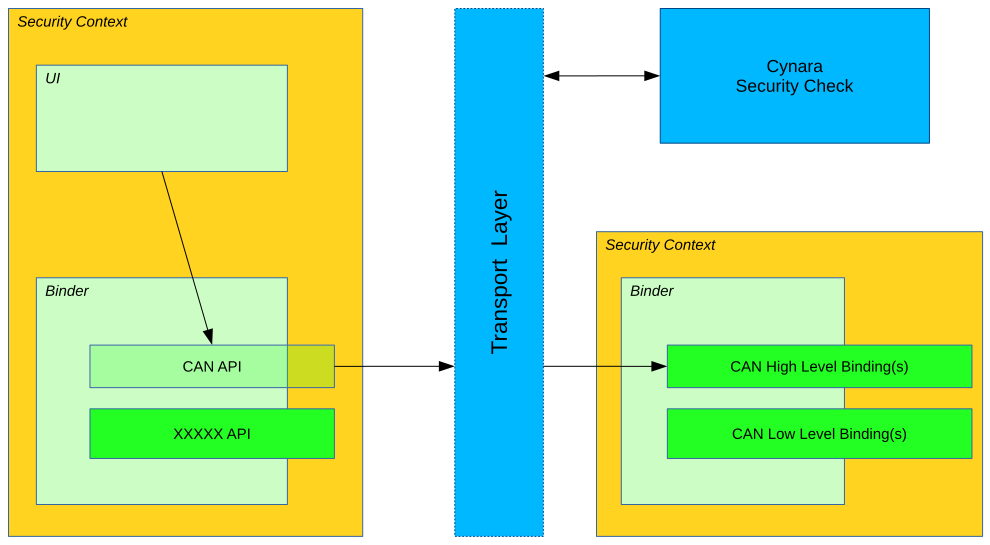

# AGL CAN binding architecture

It's meant to generate, from a JSON file describing CAN messages and diagnostic
message \(OBD2 for now\), a cpp file to integrate with the project.

Once generated binding is built with it and result will be a widget file to
install on an AGL target system.


Bringing CAN management into the AGL project is more than allowing decode and
print CAN messages, lot of tools can do that (Wireshark, CAN-utils, ...).

The goal is to provide a common API and abstraction to the CAN bus then you can
bring some more high level functionalities to the system.

CAN binding will be separated in two parts:


- High level: Binding from which others applications will connect to.
 It provides valuable access to the CAN bus by aggregate signals or providing
 new signals from several originals. For example, a signal exposing whether or
 not a door is open, no matter which one it is. Also, we can imagine an
 application which supervise if there is no one in the car but moving (1m, 2m ?)
 to alert the owner of an unexpected behavior. The high level binding will sends
 a single event representing that behavior to the application which in turn will
 send a phone message to.

- Low level: Decode messages that transit and send event through **Application
 Framework** to the subscribers with human readable message. It provides some
 basic access to the bus + some basic mathematical, statistical features
 (last_values, min, max, timestamps, averaging) as well as basic filter to get
 discerning signal only (This part are not implemented yet in the low level).



Last but not least, the low level binding can be shipped as binary only using
OpenXC inspired [AGL low level CAN binding Generator](http://github.com/iotbzh/can-config-generator).

# Prerequisites

- An AGL system installed with latest Daring Dab version with latest Application
 framework version >= 0.6.
- Make sure you built the AGL generator else you will not be able to generate
 custom low-level CAN binding.
It will produce a _application-generated.cpp_ file to paste in the source,
 _CAN-binder/low-can-binding/binding/_, directory.
- Make sure you already set up the AGL SDK using the following
 [SDK Quick Setup Guide](http://docs.iot.bzh/docs/getting_started/en/dev/reference/setup-sdk-environment.html).
 Alternatively, please refer to official guides available on [AGL Developer Site](http://docs.automotivelinux.org/docs/devguides/en/dev/#guides).

If you need to have the graphic stack inside your SDK, you have to prepare your
 environment with the **iotbzh**, or **Daring Dab** flavor using _prepare_meta_
 tool. To do so, run the following command in your docker image in the step 4
 in place of `... [ prepare build environment ] ...`:

> **NOTE** These commands assume that proprietary graphic drivers for Renesas
Porter board are located in _/home/devel/share/proprietary-renesas-rcar_ directory.

```bash
prepare_meta -f iotbzh -o /xdt -l /home/devel/mirror -p /home/devel/share/proprietary-renesas-rcar/ -t m3ulcb -e wipeconfig -e rm_work -e cleartemp
/xdt/build/m3ulcb/agl-init-build-env
```

- (Optionnal) An [USB CAN adapter](http://shop.8devices.com/usb2can) connected to
 connector through the [right cable](http://www.mouser.fr/ProductDetail/EasySync/OBD-M-DB9-F-ES/))
if you want to connect to a real car through the OBD2 connector.

# Getting started

## CAN config generator usage

### Build requirements

- CMake version 3.3 or later
- G++, Clang++ or any C++11 compliant compiler.

### Compile

```bash
source /xdt/sdk/environment-setup-aarch64-agl-linux
export PATH=$PATH:/xdt/sdk/sysroots/x86_64-aglsdk-linux/usr/bin
export WD=$(pwd)
git clone --recursive https://gerrit.automotivelinux.org/gerrit/apps/low-level-can-service -b Renesas_delivery_Q2
git clone --recursive https://gerrit.automotivelinux.org/gerrit/apps/low-level-can-generator
cd ${WD}/low-level-can-generator
mkdir -p build
cd build
cmake -G "Unix Makefiles" ..
make
```

### Naming convention

We chose a doted naming convention because it's a well know schema.

It separates and organize names into hierarchy. From the left to right, you
describe your names using the more common ancestor at the left then more you go
to the right the more it will be accurate.

Let's take an example, here is an example about standard PID name following this
convention:

```
engine.load
engine.coolant.temperature
fuel.pressure
intake.manifold.pressure
engine.speed
vehicle.speed
intake.air.temperature
mass.airflow
throttle.position
running.time
EGR.error
fuel.level
barometric.pressure
commanded.throttle.position
ethanol.fuel.percentage
accelerator.pedal.position
hybrid.battery-pack.remaining.life
engine.oil.temperature
engine.torque
```

> **NOTE** It's recommended that you follow this naming convention to named
> your CAN signals.
>
> There is only character `*` that is forbidden in names because it's used as
> wildcard for subscription and unsubscription.
>
> This described in the below chapter.

### Available decoder

You can use some basic decoder provided by default by the binding which are:

- ***decoder_t::noopDecoder*** : Default decoder if not specified, return raw
 value from signal's bitfield.
- ***decoder_t::booleanDecoder*** : Coerces a numerical value to a boolean.
- ***decoder_t::stateDecoder***s : Find and return the corresponding string
 state for a CAN signal's raw integer value.

### Generating JSON from Vector CANoe Database

> **CAUTION** This chapter has not been tested since it haven't necessary
> automotive tools for that.

If you use CANoe to store your `gold standard` CAN signal definitions, you may
be able to use the OpenXC `xml_to_json.py` script to make your JSON for you.
First, export the Canoe .dbc file as XML - you can do this with Vector CANdb++.
Next, create a JSON file according to the format defined above, but only define:

- CAN messages.
- Name of CAN signals within messages and their generic_name.
- Optionnaly name of diagnostic messages and their name.

To install the OpenXC utilities and runs `xml_to_json.py` script:

```bash
sudo pip install openxc
cd /usr/local/lib/python2.7/dist-packages/openxc/generator
```

Assuming the data exported from Vector is in `signals.xml` and your minimal mapping
file is `mapping.json`, run the script:

```bash
python -m openxc.utils ./xml_to_json.py signals.xml mapping.json signals.json
```

The script scans `mapping.json` to identify the CAN messages and signals that
you want to use from the XML file. It pulls the neccessary details of the
messages (bit position, bit size, offset, etc) and outputs the resulting subset
as JSON into the output file, `signals.json`.

The resulting file together with `mapping.json` will work as input to the code
generation script.

### Generate your config file

To generate your config file you just have to run the generator using the `-m`
option to specify your JSON file.

```bash
./can-config-generator -m ../tests/basic.json -o application-generated.cpp
```

If you omit the `-o` option, then code is generated on the stdout.
You also can specify a header and a footer file.
These files must be valid C++ fragment as long as they will be inserted as is.
Use the `-h` option to display help.

> **CAUTION:** Each `diagnostic_message` must define the same `bus` as the
> binding will use only one bus.

### Supported OpenXC items

About now, compliance with OpenXC reference is in progress, can-config-generator
and CAN\_signaling will implement them soon. `initializers`, `loopers`,
`commands` and `handlers` nodes are ignored for now.

This generator will follow OpenXC support status of the low level CAN signaling
binding.

> **NOTE**: The `buses` item will not be supported by this generator because
> the binding use another way to declare and configure buses. Please refer to
> the binding's documentation.

## Compile and install the binding

### Build requirements

- Kernel >= 4.8
- CMake version 3.3 or later
- G++, Clang++ or any C++11 compliant compiler.

### Compile

Clone the binding repository, copy the generated file and updated the git
submodules.

Execute the following commands from this repository:

```bash
cd ${WD}/low-level-can-service
cp ${WD}/low-level-can-generator/build/application-generated.cpp ../low-can-binding/binding
```

### Installation

```bash
cd ${WD}/low-level-can-service
mkdir build
cd build
cmake ..
make
make widget
```

To install it manually, you need to copy the _low-can-service.wgt_ file on your
target, then from it execute the following commands :

On your host, to copy over the network :

```bash
scp low-can-service.wgt root@<target_IP>:~
```

On the target, assuming _**wgt**_ file is in the root home directory:

```bash
afm-util install low-can-service.wgt
{ "added": "low-can-service@4.0" }
```
# Configure the AGL system

## Virtual CAN device

Connected to the target, here is how to load the virtual CAN device driver and
set up a new vcan device :

```bash
modprobe vcan
ip link add vcan0 type vcan
ip link set vcan0 up
```

You also can named your linux CAN device like you want and if you need name it
`can0` :

```bash
modprobe vcan
ip link add can0 type vcan
ip link set can0 up
```

## CAN device using the USB CAN adapter

Using real connection to CAN bus of your car using the USB CAN adapter
connected to the OBD2 connector.

Once connected, launch `dmesg` command and search which device to use:

```bash
dmesg
[...]
[  131.871441] usb 1-3: new full-speed USB device number 4 using ohci-pci
[  161.860504] can: controller area network core (rev 20120528 abi 9)
[  161.860522] NET: Registered protocol family 29
[  177.561620] usb 1-3: USB disconnect, device number 4
[  191.061423] usb 1-2: USB disconnect, device number 3
[  196.095325] usb 1-2: new full-speed USB device number 5 using ohci-pci
[  327.568882] usb 1-2: USB disconnect, device number 5
[  428.594177] CAN device driver interface
[ 1872.551543] usb 1-2: new full-speed USB device number 6 using ohci-pci
[ 1872.809302] usb_8dev 1-2:1.0 can0: firmware: 1.7, hardware: 1.0
[ 1872.809356] usbcore: registered new interface driver usb_8dev
```

Here device is named `can0`.

This instruction assuming a speed of 500000kbps for your CAN bus, you can try
others supported bitrate like 125000, 250000 if 500000 doesn't work:

```bash
ip link set can0 type can bitrate 500000
ip link set can0 up
ip link show can0
  can0: <NOARP,UP,LOWER_UP,ECHO> mtu 16 qdisc pfifo_fast state UNKNOWN qlen 10
    link/can
    can state ERROR-ACTIVE (berr-counter tx 0 rx 0) restart-ms 0
    bitrate 500000 sample-point 0.875
    tq 125 prop-seg 6 phase-seg1 7 phase-seg2 2 sjw 1
    sja1000: tseg1 1..16 tseg2 1..8 sjw 1..4 brp 1..64 brp-inc 1
    clock 16000000
```

On a Rcar Gen3 board, you'll have your CAN device as `can1` because `can0`
already exists as an embedded device.

The instructions will be the same:

```bash
ip link set can1 type can bitrate 500000
ip link set can1 up
ip link show can1
  can0: <NOARP,UP,LOWER_UP,ECHO> mtu 16 qdisc pfifo_fast state UNKNOWN qlen 10
    link/can
    can state ERROR-ACTIVE (berr-counter tx 0 rx 0) restart-ms 0
    bitrate 500000 sample-point 0.875
    tq 125 prop-seg 6 phase-seg1 7 phase-seg2 2 sjw 1
    sja1000: tseg1 1..16 tseg2 1..8 sjw 1..4 brp 1..64 brp-inc 1
    clock 16000000
```

## Rename an existing CAN device

You can rename an existing CAN device using following command and doing so move
an existing `can0` device to anything else and then use another device as
`can0`. For a Rcar Gen3 board do the following by example:

```bash
sudo ip link set can0 down
sudo ip link set can0 name bsp-can0
sudo ip link set bsp-can0 up
```

Then connect your USB CAN device that will be named `can0` by default.

# Configure the binding

The binding reads system configuration file _/etc/dev-mapping.conf_ at start to
map logical name from signals described in JSON file to linux devices name
initialized by the system. Edit file _/etc/dev-mappping.conf_ and add mapping
in section `CANbus-mapping`.

Default binding configuration use a CAN bus named `hs` so you need to map it to
the real one, here are some examples:

- Using virtual CAN device as described in the previous chapter:

```ini
[CANbus-mapping]
hs="vcan0"
ls="vcan1"
```

- Using real CAN device, this example assume CAN bus traffic will be on can0.

```ini
[CANbus-mapping]
hs="can0"
ls="can1"
```

- On a Rcar Gen3 board there is an embedded CAN device so `can0` already
 exists. So you might want to use your USB CAN adapter plugged to the OBD2
 connector, in this case use `can1`:

```ini
[CANbus-mapping]
hs="can1"
```

> **CAUTION VERY IMPORTANT:** Make sure the CAN bus\(es\) you specify in your
> configuration file match those specified in your generated source file with
> the `CAN-config-generator`.

# Run it, test it, use it !

You can run the binding using **afm-util** tool, here is the classic way to go:

```bash
afm-util run low-can-service@4.0
1
```

You can find instructions to use afm-util tool [here](http://docs.iot.bzh/docs/apis_services/en/dev/reference/af-main/afm-daemons.html#using-afm-util),
as well as documentation about Application Framework.

But you can't control nor interact with it because you don't know security
token that **Application Framework** gaves it at launch.

So, to test it, it is better to launch the binding manually. In the following
example, it will use port **1234** and left empty security token for testing
purpose:

```bash
afb-daemon --binding=/var/lib/afm/applications/low-can-service/4.0/lib/afb-low-can.so --rootdir=/var/lib/afm/applications/low-can-service/4.0/ --port=1234 --token=1
NOTICE: binding [/usr/lib/afb/afb-dbus-binding.so] calling registering function afbBindingV1Register
NOTICE: binding /usr/lib/afb/afb-dbus-binding.so loaded with API prefix dbus
NOTICE: binding [/usr/lib/afb/authLogin.so] calling registering function afbBindingV1Register
NOTICE: binding /usr/lib/afb/authLogin.so loaded with API prefix auth
NOTICE: binding [/var/lib/afm/applications/low-can-service/4.0/libs//low-can-binding.so] calling registering function afbBindingV1Register
NOTICE: binding /var/lib/afm/applications/low-can-service/4.0/libs//low-can-binding.so loaded with API prefix low-can
NOTICE: Waiting port=1234 rootdir=/var/lib/afm/applications/low-can-service/4.0/
NOTICE: Browser URL= http:/*localhost:1234
```

On another terminal, connect to the binding using previously installed
_**AFB Websocket CLI**_ tool:

```bash
afb-client-demo ws://localhost:1234/api?token=1
```

You will be on an interactive session where you can communicate directly with
the binding API.

The binding provides at this moment 2 verbs, _subscribe_ and _unsubscribe_,
which can take argument by a JSON **event** object.

The argument value is the CAN message **generic\_name** as described in the
JSON file used to generate cpp file for the binding.

To use the _**AFB Websocket CLI**_ tool, a command line will be like the
following :

```
<api> <verb> <arguments>
```

Where:

* API : _**low-can**_.
* Verb : _**subscribe**_ or _**unsubscribe**_
* Arguments : _**{ "event": "driver.doors.open" }**_

## Subscription and unsubscription

You can ask to subscribe to chosen CAN event with a call to _subscribe_ API
verb with the CAN messages name as JSON argument.

> **NOTE:** If no argument is provided, then you'll subscribe to all signals at
> once.

For example from a websocket session:

```json
low-can subscribe { "event": "doors.driver.open" }
ON-REPLY 1:low-can/subscribe: {"jtype":"afb-reply","request":{"status":"success","uuid":"a18fd375-b6fa-4c0e-a1d4-9d3955975ae8"}}
```

Subscription and unsubscription can take wildcard in their _event_ value.

To receive all doors events :

```json
low-can subscribe { "event" : "doors*" }
ON-REPLY 1:low-can/subscribe: {"jtype":"afb-reply","request":{"status":"success","uuid":"511c872e-d7f3-4f3b-89c2-aa9a3e9fbbdb"}}
```

Then you will receive an event each time a CAN message is decoded for the event
named _doors.driver.open_

```json
ON-EVENT low-can/messages.doors.driver.open({"event":"low-can\/messages.doors.driver.open","data":{"name":"messages.doors.driver.open","value":true},"jtype":"afb-event"})
```

Notice that event shows you that the CAN event is named
_messages.doors.driver.open_ but you ask for event about _doors.driver.open_.

This is because all CAN messages or diagnostic messages are prefixed by the
JSON parent node name, **messages** for CAN messages and
**diagnostic\_messages** for diagnostic messages like OBD2.

This will let you subscribe or unsubcribe to all signals at once, not
recommended, and better make filter on subscribe operation based upon their
type. Examples:

```json
low-can subscribe { "event" : "*speed*" } --> will subscribe to all messages with speed in their name. Search will be make without prefix for it.
low-can subscribe { "event" : "speed*" } --> will subscribe to all messages begin by speed in their name. Search will be make without prefix for it.
low-can subscribe { "event" : "messages*speed*" } --> will subscribe to all CAN messages with speed in their name. Search will be on prefixed messages here.
low-can subscribe { "event" : "messages*speed" } --> will subscribe to all CAN messages ending with speed in their name. Search will be on prefixed messages here.
low-can subscribe { "event" : "diagnostic*speed*" } --> will subscribe to all diagnostic messages with speed in their name. Search will be on prefixed messages here.
low-can subscribe { "event" : "diagnostic*speed" } --> will subscribe to all diagnostic messages ending with speed in their name. Search will be on prefixed messages here.
```

You can stop receiving event from it by unsubscribe the signal the same way you
did for subscribe

```json
low-can unsubscribe { "event": "doors.driver.open" }
ON-REPLY 2:low-can/unsubscribe: {"jtype":"afb-reply","request":{"status":"success"}}
low-can unsubscribe { "event" : "doors*" }
ON-REPLY 3:low-can/unsubscribe: {"jtype":"afb-reply","request":{"status":"success"}}
```

### Filtering capabilities

It is possible to limits received event notifications into minimum and maximum
boundaries as well as doing frequency thinning. This is possible using the
argument filter with one or more of the filters available :

- frequency: specify in Hertz the frequency which will be used to getting
 notified of new CAN events for the designated signal. If, during the
 blocked time, further changed CAN messages are received, the last valid one
 will be transferred after the lockout with a RX_CHANGED.
- min: Minimum value that the decoded value needs to be above to get pushed
 to the subscribed client(s).
- max: Maximum value that the decoded value needs to be below to get pushed to
 the subscribed client(s)

Order doesn't matter neither the number of filters chosen, you can use one, two
or all of them at once.

Usage examples :

```json
low-can subscribe {"event": "messages.engine.speed", "filter": { "frequency": 3, "min": 1250, "max": 3500}}
low-can subscribe {"event": "messages.engine.load", "filter": { "min": 30, "max": 100}}
low-can subscribe {"event": "messages.vehicle.speed", "filter": { "frequency": 2}}
```

## Using CAN utils to monitor CAN activity

You can watch CAN traffic and send custom CAN messages using can-utils
preinstalled on AGL target.

To watch watch going on a CAN bus use:

```bash
candump can0
```

Or for an USB CAN adapter connected to porter board:

```bash
candump can1
```

Send a custom message:

```bash
cansend can0 ID#DDDDAAAATTTTAAAA
```

You can also replay a previously dumped CAN logfiles. These logfiles can be
found in _can_samples_ directory under Git repository. Following examples use a
real trip from an Auris Toyota car.

Trace has been recorded from a CAN device `can0` so you have to map it to the
correct one you use for your tests.

Replay on a virtual CAN device `vcan0`:

```bash
canplayer -I trip_test_with_obd2_vehicle_speed_requests vcan0=can0
```

Replay on a CAN device `can0`:

```bash
canplayer -I trip_test_with_obd2_vehicle_speed_requests can0
```

Replay on a CAN device `can1` (porter by example):

```bash
canplayer -I trip_test_with_obd2_vehicle_speed_requests can1=can0
```
