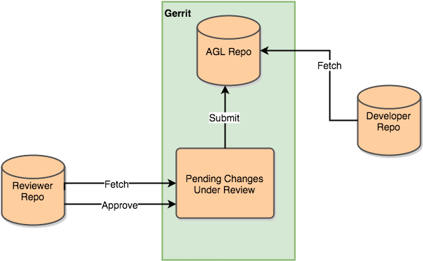

# Contributor Guidelines

Thanks for helping to improve AGL ! This page provides a general guide on making contributions to AGL. If you can't find something on this page, please feel free to contact the [mailing list]({{ site.linkto.mail_lists }}).

## Prerequisites

Before contributing to AGL, please complete the following steps:

1. Create an account on [identity.linuxfoundation.org]({{ site.linkto.account }}) to get started.
2. Join the [mailing list]({{ site.linkto.mail_lists }}).
3. Setup your Gerrit account, as described in [the Gerrit Tutorial from mediawiki](https://www.mediawiki.org/wiki/Gerrit/Tutorial)

## Working with JIRA

Issues for AGL are hosted in the [AGL JIRA server]({{ site.linkto.jira_base }}). When reporting issues, please follow [these guidelines](./issues.html).

### Claiming Issues
If you find a JIRA issue that you would like to work on, you can ask to claim it; please leave a comment indicating your intention and a committer will assign it to you. Some issues in JIRA are auto-assigned to certain contributors. If it is clear that an issue is not being worked on, feel free to work on it yourself (but please comment first to let the asignee know).

## Submitting Code

### Access Control

Access control to gerrit is defined in this [google doc spreadsheet](https://docs.google.com/spreadsheets/d/1lA_B7LEwn_VyJy_JplRNe9AOKTRGAMtpJ66JHm-vJCM/pubhtml?gid#0&single#true)

##### Gerrit Roles

The overall Gerrit workflow for a code change submitted to the project follows this diagram.


One can assume that requesting changes to be reverted will follow the same flow as those for new code and patches. Access to various functions within gerrit is granted according the roles defined here.

#### AGL Committer
The most general role in the project is the AGL-committer. They may push proposed changes to gerrit, initiate a code review of those changes, and perform code reviews of proposed changes.


#### AGL Mergers

The ability to accept and merge changes into the AGL Repositories is reserved for role of AGL-mergers. AGL-mergers have all access granted to AGL-committers as well as the ability to +2 or -2 any proposed changes and submit those changes to the AGL Repository in gerrit. Self-review  by AGL Mergers is generally frowned upon and AGL-mergers should only give a +2 or -2 after others reviewers after weighed in on the change.


#### General Access

Registered users in gerrit without any of the above access levels may fetch the repositories or may participate in reviews. This allows registered users to be added to reviews by committers without having to be added to the Committer list.



----

#### Patch Review and Merge Policy

In addition to providing comments and suggestions for improvement, reviewers are encouraged to respond to changes with an overall +1, -1 type value. The meaning of these numbers is explained in the [https://gerrit.baserock.org/Documentation/config-labels.html#label_Code-Review](Gerrit documentation)

Here is a brief summary of the values:

```
-2: This must not be merged.
-1: I would prefer that this is not merged as is.
0: I am not making any statement about this change at the moment.
+1: Looks good to me, but someone else must approve it.
+2: Looks good to me, approved.
```

These values do not get added together by Gerrit, so two +1s do not lead to an automatic merge.

Changes can only be merged to the master branch once they have received a +2 and no -2. Only members of the  AGL-Mergers group can give +2.

-----

### Gerrit Use Cases

#### Actors
  - **App Developer (AD)** - Someone who is developing applications to be used with AGL. The AD is assumed to need no knowledge of Yocto and relies on an SDK.
  - **Registered Developer (RD)** - Someone who wants to contribute code to AGL but may not be affiliated with a subsystem
  - **Subsystem Maintainer (SM)** - A SM is the same as Subsystem Developer but with additional privileges that allow him to submit changes to the master branch, tracking branch, or a maintenance branch
  - **System Integrator (SI)**
  - **Release Manager (RM)**
  - **Unregistered Developer (UD)** - A developer who downloads and uses AGL code but does not plan to contribute code.
  - **CI System Manager (CISM)**

#### Repositories

  - Meta-data repositories define Yocto layers and contain build recipes and patches. They do not contain source code other than patches
  - Source Code repositories contain source code. Build recipes for the code will being the meta-data repositories Examples include:
    - AGL is the upstream for the particular component
    - AGL is using code back-ported from later versions of a new component or part of a component (e.g., MOST USB driver in mainline kernel tree)
    - AGL is maintaining code out of the upstream tree which may or may not be accepted upstream (this should be rare since it implies a fork of the upstream code. Patches are preferable)


#### Prepare to push changes in Gerrit
By default the repo tool will have clone git repo with http for fetch and ssh to push.
   #cd meta-agl
   #git remote -v
       agl	https://gerrit.automotivelinux.org/gerrit/AGL/meta-agl (fetch)
       agl	ssh://gerrit.automotivelinux.org:29418/AGL/meta-agl (push)


if you want to use your ssh config, add your gerrit user accout to your ssh config file like:
   #cat ~/.ssh/config
     Host gerrit.automotivelinux.org
     User XXXMyNameXXX

Then you still need to enter you ssh public key in Gerrit. You can find a HowTo [[ https://www.mediawiki.org/wiki/Gerrit/Tutorial#Set_Up_SSH_Keys_in_Gerrit | here ]]

#### Push changes for review to Gerrit

##### Git Commit Messages

You are highly encouraged to describe your git commit with enough detail for someone else to understand it. In doing so, your commit message can consist of multiple lines. However, it also is highly encouraged that the first line of your commit message not exceed 50 characters. This is because some of the tooling that sits on top of git (such as the httpd apps that let you browse the repos) assumes that the first line is top-level summary that is 50 characters or less. Thus there will be highlighting and truncating of the commit message using these assumptions and it will look weird if these assumptions are not kept. There should also be a blank line between the summary and any further description.

If the commit is related to a JIRA issue, you can specify 'Bug-AGL: ' followed by the issue number.

For example, here is a good commit message:

```
Fixed the whizbang widget

Bug-AGL: SPEC-0000

- added more sanity checking in the build script.
- fixed the API to return the correct value in the scenario where there
  aren't any whizbangs present.
- corrected the documentation.
```

As an alternate to a bullet list, you could put long text here in paragraph form, with each line wrapped at 72 chars and blank lines between paragraphs.

Please sign you commit before you submit the change (otherwise it will not be accepted by gerrit):
   git commit --signoff

  * Then either use plain git to push:

   git push agl HEAD:refs/for/master
   git push <remote> HEAD:refs/for/<targetbranch>

  * **Or** for more convenience, install "git-review" and instead of git push use:

   # first time only
   git review -s

   # then to push use
   git review

Find more details in these guides:

  * [Official gerrit guide](https://gerrit.automotivelinux.org/gerrit/Documentation/user-upload.html)
  * [Git and repo cheatsheet](https://source.android.com/source/developing.html#git-and-repo-cheatsheet)
  * [git cheatsheet from github](https://education.github.com/git-cheat-sheet-education.pdf)
  * [Gerrit cheatsheet from mediawiki](https://www.mediawiki.org/wiki/User:Wctaiwan/Gerrit_cheatsheet)
  * [Git cheatsheet from opendaylight.org](https://wiki.opendaylight.org/view/GIT_Cheat_Sheet)

#### Personal Sandbox Projects in Gerrit

First time:

```
   meta-agl> git push gerrit testsandbox:refs/heads/sandbox/jsmoeller/test
  Total 0 (delta 0), reused 0 (delta 0)
  remote: Processing changes: closed: 114, refs: 1, done
  To ssh://jsmoeller@gerrit.automotivelinux.org:29418/AGL/meta-agl
   * [new branch]      testsandbox -> sandbox/jsmoeller/test''
```

Push to personal branch:

```
  git push gerrit testsandbox:refs/for/sandbox/jsmoeller/test
  Counting objects: 2, Fertig.
  Delta compression using up to 8 threads.
  Compressing: 100% (2/2), Fertig.
  Writing objects: 100% (2/2), 327 bytes | 0 bytes/s, Fertig.
  Total 2 (delta 1), reused 0 (delta 0)
  remote: Resolving deltas: 100% (1/1)
  remote: Processing changes: new: 1, refs: 1, done
  remote:
  remote: New Changes:
  remote:   https://gerrit.automotivelinux.org/gerrit/5643 test1
  remote:
  To ssh://jsmoeller@gerrit.automotivelinux.org:29418/AGL/meta-agl
   * [new branch]      testsandbox -> refs/for/sandbox/jsmoeller/test
```

----

----

#### Notes on Use Cases
    * In this context a subsystem is part of the AGL platform code (meta-agl, meta-ivi-common, meta-oe, etc.). A subsystem may have a meta-data repository and/or multiple Code repositories
    * In this context an App is any code that runs on the AGL platform and will generally be part of Code Repositories
    * A role of App Maintainer can be envisioned, but since the App Developer has the power of +2 an App Maintainer was not included

#### Use Cases

### App Developer Use Cases

    - As an AD I want to write App code and approve code (+2) without getting +2 from anyone else.
    - As an AD I want to write App code and request reviews from any other developers
    - As an AD I want to submit patches to the AGL subsystems for review by SDs and SMs.

### Subsystem Developer Use Cases

    - On further review the SD role is identical to the RD and can be removed (Walt 21 Mar 2016)
    - <del>As a SD I want to write code and submit it for review by other developers. They can be RDs, SDs and/or SMs<del>
    - <del>As a SD I want to review code and approve or reject it. (+1, -1)</del>


### Subsystem Maintainer Use Cases
    - As a SM I want to review and approve code (+1,+2) submitted to my subsystem
    - As a SM I want to review and reject code (-1,-2) submitted to my subsystem
    - <del>As a SM I want to review and approve code (+1) submitted to my subsystem</del>
    - As a SM I want to write code for my subsystem and submit for review by other developers (+1) and SMs (+1 or +2)
      - Alternate Scenario
        - As a SM I want to write code and push it to master without getting +2 from another SM
    - As a SM I want to pull changes from upstream for the packages that are part of the subsystem.
    - As a SM I want to push changes upstream for the packages that are part of the subsystem
    - As a SM I want to back port new features (code) to AGL code from upstream. In some cases this will be patches and in some cases this is source code.
    - As a SM I want to create branches to test changes prior to merging to the master branch.

### Registered Developer Use Cases
    - As a RD I want to download AGL pre-built binaries
    - As a RD I want to write code for a subsystem and submit it for review (+1, +2) by SMs or RDs (+1)
    - As a RD I want to write code for an existing app and submit it for review (+1, +2) by the ADs for the particular app.
    - As a RD I want to review code and approve or reject it. (+1, -1)
    - As a RD I want to be able to create a sandbox branch to develop code within the AGL build environment and share the sandbox branch with other RDs for collaboration
    - As a RD I do not want other RDs to push to my sandbox branch
    - As a RD I want to build other RDs sandbox branches in my environment and add changes using to it using my own sandbox branch.
    - As a RD I want to push sandbox code into the AGL platform and have it maintained as part of the regular process. Once this is accomplished the AGL platform becomes the upstream for the formerly sandboxed code

### Unregistered Developer Use Cases
  - As a UD I want to see AGL source code
  - As a UD I want to download AGL pre-built binaries

### System Integrator Use Cases
  - As a SI I want to update the Yocto version of the entire AGL code base.
  - As a SI I want to add additional boards to be supported to the build
  - As a SI I want to approve all changes to the master for meta-data repositories (+2)
  - As a SI I want to tag Release Candidates on the master branch and inform team members how to access those release candidates
  - As a SI I want to inform the RM that a stable release should be prepared
  - As a SI I want to inform the RM that a patch release should be prepared

### Release Manager
  - As a RM I want to create maintenance branches for stable releases
  - As a RM I want to approve all changes to maintenance branches for meta-data repositories (+2)
  - As a RM I want to tag stable releases and be able to recreate the build for those stable releases
  - As a RM I want to make patch releases to stable releases


## Documentation

### Markdown format and Extensions

The documentation is written using Markdown format.

The developpers site is generated using  [Jekyll](https://jekyllrb.com) which in turn uses [Kramdown](http://kramdown.gettalong.org/) to generate HTML. Kramdown is compatible with most extensions introduced by [PHP Markdown Extra](http://michelf.com/projects/php-markdown/extra/)

Here a the reference guides for Markdown syntax:

* [Kramdown Quick Reference Guide](http://kramdown.gettalong.org/quickref.html)
* [Kramdown Syntax](http://kramdown.gettalong.org/syntax.html)

### Markdown Editors

Here are some editors specialized in Markdown, in no particular order.

#### Online editors

* [Dillinger](http://dillinger.io/) (GitHub support)
* [SlackEdit](https://stackedit.io/) (GitHub support)
* [Online Kramdown Editor](https://kramdown.herokuapp.com/)

#### Offline editors

* [Atom](https://atom.io/) (for live preview, use Packages > Markdown > Toggle Preview)
* [retext](https://github.com/retext-project/retext)
* [remarkable](http://remarkableapp.github.io/)
